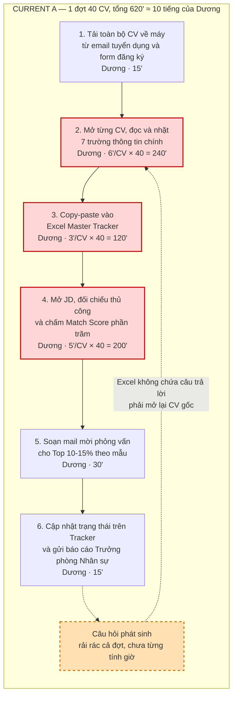
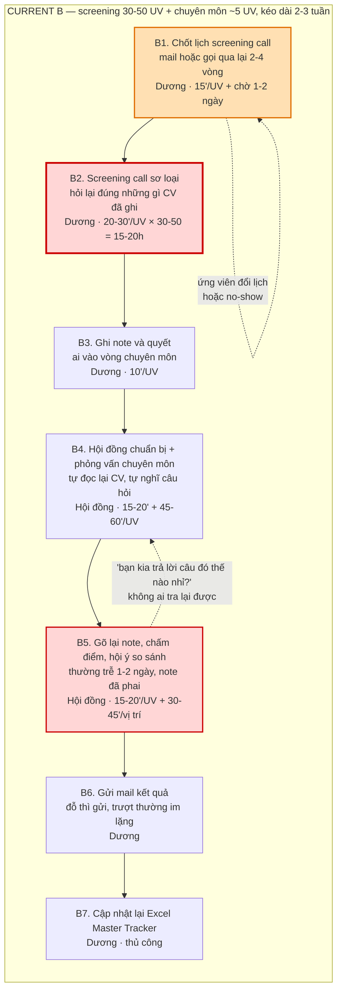
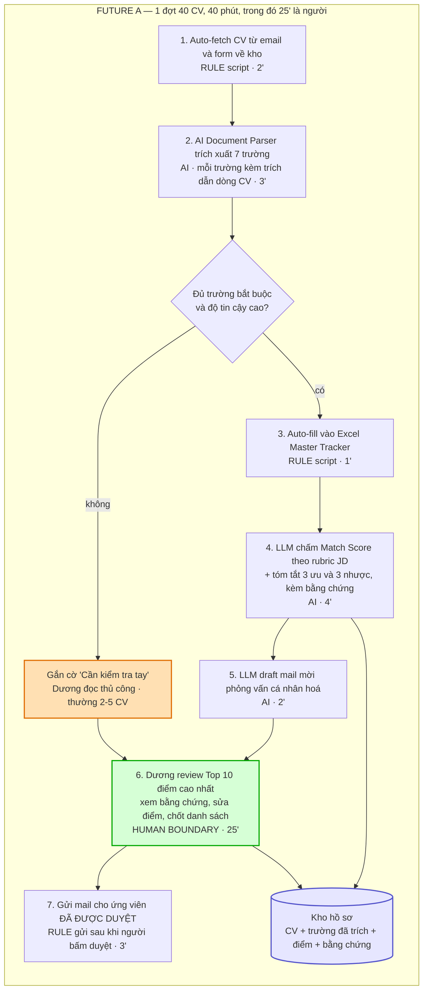
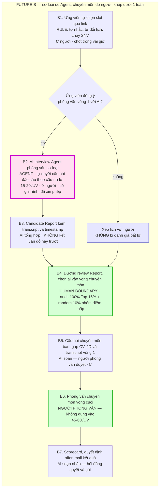
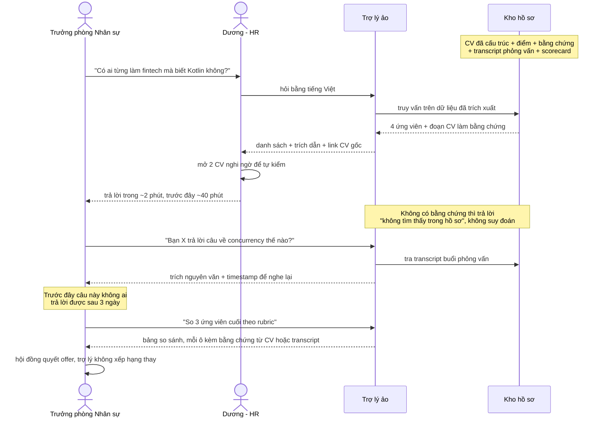

# Group Report — Day 02

## Thành viên nhóm

| STT | Họ và tên | Mã học viên | Vai trò trong nhóm |
|-----|-----------|-------------|--------------------|
| 1 | Đinh Lê Hoàng Danh | 2A202601890 | Thành viên |
| 2 | Lưu Nhân Triệu Dương | 2A202601695 | Thành viên |
| 3 | Nguyễn Văn Hiếu | 2A202601831 | Thành viên |
| 4 | Nguyễn Lê Minh | 2A202601573 | Leader |

## Bài toán nhóm chọn

**Hệ thống hỗ trợ tuyển dụng theo đợt** cho HR Recruiter và Trưởng phòng Nhân sự — giai đoạn A: sàng lọc CV; giai đoạn B: vòng phỏng vấn.

| Mục | Nội dung |
|---|---|
| Candidate được chọn | #6 — Trích xuất CV, cập nhật tracker, so sánh với JD và chấm Match Score |
| Actor chính | Dương — HR Recruiter, công ty ~150 người, mỗi đợt 30-50 CV |
| Baseline đã đo | 620'/đợt 40 CV cho giai đoạn A; độ trễ phản hồi ứng viên 3-5 ngày |
| Quyết định cuối | **Go** cho No AI + Rule điều phối + Workflow (13/14 bước) · **Not Yet** cho AI Interview Agent (B2) |

## Mục lục

| Phần | Nội dung | Worksheet |
|---|---|---|
| [Phần 1](#phần-1--hội-tụ-nhóm-từ-12-candidates-về-1-phase-3) | Hội tụ: 12 candidates → cluster → shortlist → chọn 1 | Phase 3 |
| [Phần 2](#phần-2--kiểm-chứng-nhanh--research-giải-pháp-phase-4) | Kiểm chứng nhanh + research giải pháp đã có | Phase 4 |
| [Phần 3](#phần-3--workflow-trướcsau--problem-statement-v0-phase-5) | Workflow trước/sau, fallback, Problem Statement v0 | Phase 5 |
| [Phần 4](#phần-4--rule--workflow--agent--quyết-định-cuối-phase-6) | Rule / Workflow / Agent, Problem Statement v1, quyết định cuối | Phase 6 |

---

# Phần 1 — Hội tụ nhóm: từ 12 candidates về 1 (Phase 3)

Quy trình gồm 4 bước: trình bày candidate → gom cluster theo dạng công việc → shortlist → chấm điểm và đồng thuận.

### Bước 1.1 — 12 candidate problems

|  # | Người đưa ra | Candidate problem | Người gặp vấn đề | Điểm nghẽn | Đánh giá sơ bộ |
| -: | --- | --- | --- | --- | --- |
| 1 | Danh | Đọc slides/docs AIC, tổng hợp framework để giao task và báo cáo mentor | Team Leader và thành viên team | Mất gần **1 ngày** đọc và tổng hợp thủ công | Phù hợp AI Workflow/Agent; cần kiểm tra khả năng xử lý nhiều định dạng tài liệu |
| 2 | Danh | Xem lại record tập huấn AIC 2026 và tóm tắt cho team | Team Leader và thành viên team | Video dài, xem lại và ghi chú thủ công tốn thời gian | Phù hợp AI Workflow (speech-to-text + tóm tắt); rủi ro ở chất lượng âm thanh và thuật ngữ |
| 3 | Danh | Quản lý chi tiêu chung và chia bill hằng ngày | Danh và người ở chung | Quên ghi bill, nhiều người trả trước, khó đối soát cuối tháng | Rule-based + OCR là đủ; chưa rõ AI có cần thiết |
| 4 | Dương | Tạo và đăng video ngắn từ TikTok Livestream lên Facebook | Media Creator và người theo dõi Fanpage | Tua video tìm highlight, cắt clip, viết caption và đăng thủ công | AI Workflow tiềm năng; chất lượng chọn highlight vẫn cần người kiểm duyệt |
| 5 | Dương | Trích xuất dữ liệu báo cáo kế toán tuần từ email vào Excel Template | Kế toán viên, Kế toán trưởng, Giám đốc | Nhặt số liệu nhiều file, chuẩn hoá, điền template, viết nhận xét | Workflow kết hợp Rule và AI; cần validation chặt và human review |
| 6 | Dương | Trích xuất CV, cập nhật tracker, so sánh JD và chấm Match Score | HR Recruiter, Trưởng phòng HR, ứng viên | Đọc 30-50 CV, nhập liệu và đánh giá thủ công, **8-10 tiếng/đợt** | Tác động lớn; AI chỉ nên hỗ trợ xếp hạng và giải thích, quyết định do người |
| 7 | Hiếu | Tổng hợp, làm sạch và gán nhãn tập dữ liệu hình ảnh | Team AI/NCKH phụ trách dữ liệu | **2-5 phút/ảnh**, kéo dài **1-2 tuần/đợt** | AI Workflow phù hợp để đề xuất nhãn; human review bắt buộc |
| 8 | Hiếu | Onboarding thành viên mới vào codebase | Thành viên mới, Mentor, Senior | Tài liệu rời rạc; Senior trả lời câu hỏi lặp lại | RAG tiềm năng; cần giới hạn phạm vi, kiểm soát hallucination và bảo mật |
| 9 | Hiếu | Tổng hợp tin nhắn, thông báo và Q&A trên Discord khoá học | Học viên, Mentor, TA | Lọc hàng trăm tin nhắn, **30-60 phút/ngày**, dễ bỏ sót | Phù hợp AI Workflow/Bot; cần đính kèm link tin nhắn gốc |
| 10 | Minh | Viết test case và chạy lại regression sau mỗi build | QA/Tester, Developer | Vòng lặp test thủ công; ~200 case có thể mất nhiều ngày | AI phù hợp draft test case; regression nên dùng Playwright/Cypress |
| 11 | Minh | Review code / Pull Request | Reviewer, tác giả PR, Tech Lead | Reviewer phải dựng lại ý định tác giả; diff dài làm tăng thời gian | AI hữu ích để tóm tắt diff và vùng rủi ro; người vẫn chịu trách nhiệm approve |
| 12 | Minh | Giảng viên không biết sinh viên không hiểu bài đến khi kiểm tra | Giảng viên và sinh viên | Thiếu tín hiệu phản hồi; độ trễ phát hiện **3-6 tuần** | No-AI process fix (exit ticket) giải phần lớn; AI chỉ cần khi lớp đông |

### Bước 1.2 — Cluster

Nhóm gom theo **dạng công việc** thay vì theo lĩnh vực: hai bài khác ngành nhưng cùng dạng thì cách giải giống nhau.

| Cluster | Candidates | Pattern chung | Nhận xét |
|---|---|---|---|
| **A — Trích xuất có schema** | #3, #5, #6 | Đầu vào file/ảnh/email không đồng nhất, đầu ra là các trường đã biết trước | Dạng dễ đo đúng-sai nhất; cũng là vùng đã có nhiều lời giải sẵn |
| **B — Tóm tắt nguồn dài** | #1, #2, #8, #9, #11 | Đầu vào dài, đầu ra là bản tóm tắt để người khác quyết; không có đáp án đúng duy nhất | Cluster đông nhất (5/12) nhưng khó đo nhất: nhóm không định nghĩa được "tóm tắt tốt" |
| **C — Đánh giá theo tiêu chí không viết ra** | #6, #7, #10 | Áp bộ tiêu chí nằm trong đầu người lên từng đơn vị; kết quả không tái lập được | Nghẽn **chất lượng**, không phải nghẽn giờ |
| **D — Việc lặp có khuôn / tín hiệu đến muộn** | #4, #10, #12 | Lặp theo khuôn cố định, hoặc biết được thì đã trễ | Phần lớn giải bằng automation thuần hoặc process fix, không cần AI |

Bốn kết luận sau khi cluster:

1. **#6 là candidate duy nhất nằm ở hai cluster (A và C)** — vừa trích xuất có schema (7 trường), vừa đánh giá theo tiêu chí ẩn (Match Score). Nhờ đó phần so sánh Rule / Workflow / Agent mới có nhiều mức để cân nhắc.
2. **Cluster B đông nhưng yếu**: không bài nào trả lời được "tóm tắt sai thì phát hiện bằng cách nào". Nguyên tắc ghi lại: bài không định nghĩa được thế nào là sai thì không nên chọn deep-dive.
3. **Cluster C mới là chỗ đáng giải**: tăng tốc khâu nhập liệu chỉ làm việc quyết định sai diễn ra nhanh hơn.
4. **#5 và #6 cùng cluster A nhưng khác hẳn về hậu quả**: #5 sai thì ra số liệu sai, kiểm được bằng đối chiếu tổng; #6 sai thì loại nhầm một con người và không ai biết.

### Bước 1.3 — Shortlist

Tiêu chí sàng: có người trong nhóm hiểu workflow thật không · actor có cụ thể không · bottleneck có phải một bước cụ thể không · impact đo được không · vẽ được before/after không · so sánh được R/W/A không · có quá rộng cho lab không.

| Candidate | Vì sao vào shortlist | Rủi ro / điều chưa rõ |
|---|---|---|
| **#6 — Trích xuất CV, chấm Match Score** | Người kể là người đang làm, có Excel Master Tracker và hộp mail thật mở được tại lab. Workflow tuyến tính, mỗi bước có actor và đo được thời gian. Impact đo bằng phút/CV, giờ/đợt, số ngày phản hồi. Nằm ở cả cluster A và C | Rủi ro nặng nhất là **loại nhầm âm thầm** — CV bị chấm thấp oan nằm dưới đáy bảng, không lọt vào phần người review. Chưa rõ mỗi đợt gọi phỏng vấn bao nhiêu người. Dữ liệu ứng viên là dữ liệu cá nhân, tuyển dụng là vùng nhạy cảm pháp lý |
| **#5 — Báo cáo kế toán tuần** | Cùng dạng trích xuất có schema nhưng sạch hơn: đầu ra là template cố định, đúng/sai kiểm được bằng đối chiếu tổng. Lặp đều mỗi tuần | Yêu cầu độ chính xác gần tuyệt đối. Phần lớn công việc là Rule + template mapping, nên phần so sánh R/W/A sẽ không có gì để cân nhắc |
| **#11 — Review code / Pull Request** | Cả 4 thành viên đều là actor nên lấy dấu hiệu nhanh nhất. Có chỗ dựa nghiên cứu (DORA 2025). Đo bằng phút/PR, thời gian PR chờ, số vòng comment | Đang gộp "review" và "debug". Metric phút/PR dễ tối ưu nhầm hướng (review nhanh hơn nhưng bug lọt nhiều hơn) và nhóm chưa có chỉ số đối trọng. Chưa ai đo phút/PR trên repo thật |

Ba candidate bị gạt sát shortlist:

- **#7 (gán nhãn ảnh)** — impact lớn nhất về giờ (1-2 tuần/đợt) nhưng đã có cả một ngành công cụ giải (pre-labeling, active learning: Label Studio, CVAT, Roboflow).
- **#8 (onboarding codebase)** — pain thật nhưng đầu ra "người mới hiểu codebase nhanh hơn" không đo được; ràng buộc bảo mật source code làm pilot khó thực hiện.
- **#9 (Discord digest)** — dễ làm nhưng impact nhỏ (30-60 phút/ngày rải cho nhiều người) và nằm trọn trong cluster B.

Các candidate còn lại: **#1, #2** trùng dạng #8/#9 nhưng khó đo hơn; **#3** chỉ cần Rule + OCR; **#4** phụ thuộc gu cá nhân, không có tiêu chí kiểm; **#10** phần đáng giải là automation thuần và nhóm không có ai làm QA; **#12** exit ticket giấy giải xong phần lớn, giữ lại làm ví dụ đối chiếu cho nguyên tắc "không cần AI vẫn là kết luận tốt".

### Bước 1.4 — Chấm điểm và đồng thuận

Thang 1-5; mục tiêu là ép nhóm nói rõ lý do, không phải xếp hạng tuyệt đối.

| Candidate | Actor rõ | Workflow rõ | Pain có evidence | Impact đo được | Làm trong lab | So sánh R/W/A | Hiểu domain | Tổng |
|---|---:|---:|---:|---:|---:|---:|---:|---:|
| **#6 — Trích xuất CV + Match Score** | 5 | 5 | 5 | 5 | **3** | 5 | 5 | **33** |
| #5 — Báo cáo kế toán tuần | 5 | 5 | 4 | 4 | 4 | **2** | 4 | 28 |
| #11 — Review code / PR | 5 | 4 | 4 | **3** | 4 | 4 | 5 | 29 |

Giải thích các điểm số quyết định:

- **#6 đạt 5 ở `Pain có evidence`**: Dương mở Excel Master Tracker và hộp mail của đợt gần nhất ngay tại chỗ, đếm được 40 dòng và đối chiếu được timestamp. Hai bài còn lại chỉ có báo cáo ngành và trí nhớ.
- **#6 chỉ đạt 3 ở `Làm trong lab`**: bài trải nhiều bước, chạm dữ liệu cá nhân, và mở rộng sang vòng phỏng vấn thì vượt mức một buổi lab. Nhóm chấp nhận với điều kiện pilot phải cắt mỏng (Bước 3.2).
- **#5 chỉ đạt 2 ở `So sánh R/W/A`** — lý do chính khiến nó thua dù các tiêu chí khác đều mạnh. Bài gần như thuần Rule nên Phần 4 sẽ chỉ có một đáp án hiển nhiên.
- **#11 chỉ đạt 3 ở `Impact đo được`** vì phút/PR dễ tối ưu nhầm hướng và nhóm chưa có chỉ số đối trọng.

**Candidate được chọn: #6 — Trích xuất CV, cập nhật tracker, so sánh với JD và chấm Match Score** (Problem Card #3 của Dương). Dương nhận 30-50 CV mỗi đợt; đợt gần nhất 40 CV mất 8-10 tiếng cho toàn bộ chuỗi tải CV → nhặt 7 trường → gõ Excel Master Tracker → đối chiếu JD và chấm Match Score → soạn mail mời phỏng vấn. Ở bước này nhóm mới chốt candidate problem; phạm vi chính xác được quyết ở Phần 3 sau khi vẽ xong workflow.

Năm lý do chọn:

1. **Người kể là người làm.** Đây là candidate duy nhất trả lời được câu hỏi "bước này mất bao lâu" bằng số ngay tại chỗ, kèm file thật.
2. **Workflow vẽ được từ đầu đến cuối**, các bước tuyến tính, mỗi bước có actor và input/output rõ.
3. **Nghẽn không nằm ở chỗ dễ đoán.** Chỗ đau không phải "đọc 40 CV mệt" mà là bước chấm Match Score: tiêu chí không viết ra nên không kiểm được và không tái lập được.
4. **Bài duy nhất nằm ở hai cluster**, nên bắt buộc so cả ba mức Rule / Workflow / Agent.
5. **Có ranh giới người/máy thật.** Loại nhầm một ứng viên là hậu quả lên một con người, nên câu hỏi boundary có trọng lượng.

Vì sao loại các candidate còn lại:

| Candidate | Lý do loại |
|---|---|
| #11 — Review code / PR | Đang là hai bài gộp một (review và debug); tách xong phần còn lại chưa chắc đủ lớn. Metric phút/PR dễ tối ưu nhầm hướng và chưa có chỉ số đối trọng. Bài đáng làm khi có repo và dữ liệu thật |
| #5 — Báo cáo kế toán tuần | Gần như thuần Rule (mapping template + validation số), phần so sánh R/W/A chỉ còn một đáp án. Ghi lại là bài nên triển khai thật tại công ty, không phải bài để phân tích trong lab |
| #7 — Gán nhãn ảnh | Đã có cả một ngành công cụ giải; nhóm chỉ mô tả lại thứ đã có |
| #1, #2, #8, #9 | Cùng cluster B; không bài nào trả lời được "tóm tắt sai thì phát hiện bằng cách nào" |
| #10 — Test case + regression | Không ai trong nhóm làm QA, mọi số đều đi mượn; phần regression nên giải bằng automation thuần |
| #12 — Sinh viên không hiểu bài | Exit ticket giấy giải phần lớn bottleneck với chi phí gần bằng không |
| #3, #4 | #3 chỉ cần Rule + OCR; #4 phụ thuộc gu cá nhân, không có tiêu chí kiểm đúng/sai |

**Xử lý bất đồng.** Có hai bất đồng thực chất:

- **#6 hay #11** — Minh giữ #11 vì cả nhóm đều là actor nên kiểm chứng nhanh nhất. Hiếu phản biện: chính vì cả nhóm đều là dev nên sẽ tự trả lời thay người dùng và không ai kiểm được, còn #6 buộc phải đi hỏi mới biết.
- **#6 hay #5** — Danh giữ #5 vì sạch hơn, sai là biết ngay nhờ đối chiếu tổng. Dương phản đối chính bài của mình: "#5 sai thì dò lại được trong 10 phút; #6 sai thì không bao giờ biết là đã loại nhầm ai."

Nhóm không vote, mà đặt hai câu hỏi quyết định:

1. *Candidate nào lấy được số thật trong 30 phút tới?* — #6 có Excel Master Tracker và hộp mail mở được ngay; #11 phải đo phút/PR trên repo chưa ai ghi lại; #5 có file nhưng nằm ở máy công ty.
2. *Candidate nào mà làm sai gây hậu quả lên một con người?* — chỉ #6. Chính điều làm #6 rủi ro hơn cũng khiến nó đáng phân tích hơn.

Ba ràng buộc kèm theo quyết định chọn #6:

- Điểm 3 ở "làm trong lab" là điểm yếu thật; pilot phải giữ mỏng.
- #11 được giữ làm phương án backup.
- #5 được ghi vào nhóm "nên làm thật nhưng không làm trong lab".

**Điều kiện quay đầu (ghi trước khi sang Phần 2):** nếu phỏng vấn 2 HR ngoài nhóm cho thấy họ mất dưới 2 tiếng mỗi đợt, hoặc công ty họ đã có ATS làm gần hết phần này, thì #6 bị hạ và nhóm chuyển sang #11.

---

# Phần 2 — Kiểm chứng nhanh + Research giải pháp (Phase 4)

### Bước 2.1 — Quick validation

Nhóm thực hiện 3 interview và mở trực tiếp dữ liệu thật.

> Quy ước: **[đo]** là số bấm giờ hoặc đếm được từ file thật; **[nhớ lại]** là số người trả lời tự ước lượng, sai số có thể lớn. Không số nào lấy từ AI.

**Interview 1 — Dương (trong nhóm, HR Recruiter, công ty ~150 người)**

- Đợt gần nhất: 2 vị trí Mobile Dev, kết thúc 3 tuần trước, 40 CV **[đo — đếm trên Excel Master Tracker]**.
- Bấm giờ lại trên 3 CV tại lab: đọc và nhặt thông tin **6'/CV**, gõ vào Excel **3'/CV** **[đo, mẫu nhỏ]**.
- Bước khó chịu nhất không phải đọc CV mà là **chấm Match Score**: "không biết mình chấm đúng không, hôm sau chấm lại có khi ra số khác".
- Chi tiết ngoài dự kiến: Trưởng phòng Nhân sự thường hỏi ad-hoc ("có ai từng làm fintech không?") mà Excel không trả lời được, buộc mở lại CV gốc — **nghẽn thứ ba, không có trong card**.

**Interview 2 — HR ngoài nhóm (công ty ~600 người, có ATS)**

- Đã tự động phần trích xuất, nhưng phần chấm phù hợp vẫn làm tay: "ATS chỉ lọc được từ khoá, nó không biết 3 năm React ở agency khác 3 năm React ở product" **[nhớ lại]**.
- Vẫn mất **3-4 tiếng/đợt** cho đọc và xếp hạng **[nhớ lại]**.
- Ghi nhận quan trọng: "Chỗ mất thời gian nhất bây giờ không phải CV, mà là gọi screening."

**Interview 3 — HR freelance tuyển cho startup**

- Không dùng ATS, chỉ Google Sheet; xác nhận đúng workflow của Dương **[nhớ lại]**.
- Phản hồi ứng viên trượt: "gần như không gửi, không đủ thời gian" — trùng với bước B6 ở Phần 3.

**Ba điều chỉnh sau validation:**

1. **Nhóm đã hỏi sai câu ở lần đầu.** Giả định ban đầu là "nghẽn ở đọc 40 CV". Người làm thật chỉ ra nghẽn nằm ở 200 phút chấm Match Score vì nó không tái lập được. Nghẽn giờ và nghẽn chất lượng là hai loại khác nhau.
2. **Phần dễ trình bày nhất lại đã có lời giải sẵn.** Trích xuất CV là bài toán ATS đã giải nhiều năm.
3. **Câu hỏi chưa trả lời được và quan trọng nhất:** mỗi đợt công ty thật sự screening bao nhiêu người — 5 hay 30-50? Card ghi mời Top 10-15% (~5 người), nhưng mô tả tại lab lại là 30-50. Nếu là 5 thì toàn bộ lý do tồn tại của AI Interview Agent không còn.

### Bước 2.2 — Research giải pháp đã có

| Nguồn / tool / case | Link | Giải quyết phần nào | Điểm mạnh | Khoảng trống / rủi ro | Bài học |
|---|---|---|---|---|---|
| **ATS phổ thông (Greenhouse, Ashby, Lever)** | [greenhouse.com](https://www.greenhouse.com/) · [ashbyhq.com](https://www.ashbyhq.com/) | Bước 1-3 và bước 6: nhận CV, lưu hồ sơ, theo dõi trạng thái | Đã trưởng thành, có báo cáo funnel sẵn | Phần đánh giá độ phù hợp vẫn là người; ATS chỉ lọc từ khoá | Đây là phương án No-AI phải so trước. Nhóm phải chứng minh nghẽn nằm ở bước 4 |
| **Resume parsing API (Affinda, Rchilli, Textkernel)** | [affinda.com/resume-parser](https://www.affinda.com/resume-parser) | Bước 2-3: PDF/Word/ảnh → JSON có schema | Schema chuẩn, xử lý nhiều định dạng | CV dạng ảnh và layout nhiều cột vẫn gãy; parse hỏng âm thầm | Không tự viết parser, nhưng bắt buộc có cổng độ tin cậy để gắn cờ đẩy sang người |
| **Metaview — AI ghi và tóm tắt phỏng vấn** | [metaview.ai](https://www.metaview.ai/) | Bước B5: ghi note, tóm tắt, sinh nhận xét có cấu trúc | Giải đúng nghẽn "note gõ lại sau 2 ngày đã méo"; ranh giới sạch | Không đụng B1 và không tự phỏng vấn | Mô hình boundary đáng học nhất: AI đứng cạnh cuộc phỏng vấn, không đứng thay |
| **HireVue — phỏng vấn AI vòng 1** | [hirevue.com](https://www.hirevue.com/) | Bước B2: phỏng vấn sơ loại không đồng bộ, chấm điểm | Chứng minh mức Agent khả thi về kỹ thuật | Vướng kiện tụng và tranh cãi bias; đã bỏ tính năng phân tích nét mặt năm 2021 | Nếu làm Agent: không chấm qua giọng nói, nét mặt, ngoại hình; mọi kết luận phải trỏ về transcript gốc |
| **Case Amazon bỏ công cụ tuyển dụng AI (2018)** | [Reuters](https://www.reuters.com/article/us-amazon-com-jobs-automation-insight-idUSKCN1MK08G) | Case thất bại | — | Model học từ 10 năm CV lịch sử nên tự học thiên lệch giới; Amazon bỏ dự án | Không train/tinh chỉnh trên dữ liệu tuyển dụng lịch sử; chấm theo rubric viết tay |
| **NYC Local Law 144** | [nyc.gov](https://www.nyc.gov/site/dca/about/automated-employment-decision-tools.page) | Ràng buộc pháp lý | — | Bắt buộc audit bias độc lập hằng năm và thông báo cho ứng viên; không ràng buộc tại VN | Vẫn nên lấy làm chuẩn tự đặt: báo trước cho ứng viên và kiểm tra định kỳ nhóm bị chấm thấp |
| **EU AI Act — Annex III** | [artificialintelligenceact.eu/annex/3](https://artificialintelligenceact.eu/annex/3/) | Ràng buộc pháp lý | — | Sàng lọc hồ sơ và đánh giá ứng viên bị xếp rủi ro cao, kèm yêu cầu giám sát của con người | Giám sát của con người là yêu cầu mặc định của loại bài này |
| **Công cụ tự chọn lịch (Calendly, GoodTime)** | [calendly.com](https://calendly.com/) | Bước B1: chốt lịch phỏng vấn | Rẻ, triển khai trong một buổi, không cần AI | Không giải quyết gì ngoài lịch | Quick win rẻ nhất; nghẽn độ trễ ở B1 không cần AI |

**Cách kiểm nguồn:** 8 link đều được mở và đọc trực tiếp tại lab. Case Amazon và việc HireVue bỏ tính năng phân tích nét mặt được đọc từ bản tin gốc. Các con số về thị phần ATS hoặc "AI giảm X% thời gian tuyển" do AI đưa ra đã bị loại vì không truy được về nguồn sơ cấp.

**Ba kết luận kéo về bài toán nhóm:**

1. **Khoảng trống nằm ở chấm điểm, không nằm ở trích xuất.** Trích xuất CV đã được ATS và parsing API giải. Phần chưa ai làm tốt là chấm điểm có rubric tường minh và có trích dẫn bằng chứng — đúng chỗ người làm thật nói khó chịu nhất.
2. **Loại bài này hỏng theo cách âm thầm.** Nó không báo lỗi, chỉ xếp sai người xuống đáy bảng. Vì vậy pilot phải chạy song song: sàng cùng một đợt bằng cả tay lẫn hệ thống rồi so hai danh sách.
3. **Phần rẻ nhất phải làm trước.** Link tự chọn lịch cho B1 và rubric chấm điểm viết ra giấy cho bước 4 đều không cần AI. Nếu hai việc này giải xong phần lớn nghẽn thì kết luận đúng là **Not Yet** chứ không phải Go.

---

# Phần 3 — Workflow trước/sau + Problem Statement v0 (Phase 5)

### Bước 3.0 — Điều chỉnh so với Problem Card

**Điều chỉnh 1 — "9 tiếng" không phải một nghẽn mà là ba.** Card gộp bước 2, 3, 4 thành một bottleneck 560' (~9,3h). Khi tách ra:

| Loại nghẽn | Bước | Bản chất | Hướng giải |
|---|---|---|---|
| Nghẽn khối lượng | 2 + 3 | **360'** — lặp lại, mơ hồ thấp, đọc văn bản rồi điền 7 trường cố định | Trích xuất có schema |
| Nghẽn khối lượng **và** chất lượng | 4 | **200'** — vừa tốn giờ, vừa là chỗ tiêu chí không viết ra nên không tái lập được | Rubric tường minh + AI chấm kèm trích dẫn, người duyệt |
| Nghẽn truy vấn | quanh bước 5-6 | Excel chỉ trả lời được các cột có sẵn | Trợ lý ảo hỏi-đáp trên kho hồ sơ |

Nghẽn truy vấn là phần card cũ bỏ sót: mỗi câu hỏi ad-hoc của Trưởng phòng Nhân sự đều buộc mở lại CV gốc, và công việc này rơi rải rác cả đợt nên **không nằm trong 620 phút đã đo**.

**Điều chỉnh 2 — chi phí thật nằm sau bước mời phỏng vấn.** Card coi bước 6 là điểm kết, nhưng sau đó còn: chốt lịch, chuẩn bị câu hỏi, phỏng vấn, gõ lại note, hội ý, gửi kết quả.

| | Giai đoạn A — Sàng lọc CV | Giai đoạn B — Phỏng vấn |
|---|---|---|
| Ai làm | Dương, 1 người | Dương + Trưởng phòng Nhân sự + tech lead |
| Giờ người/đợt | ~10h | ~20h (2h × 10 ứng viên) |
| Giá của giờ đó | Giờ HR | Giờ của người đắt hơn nhiều |
| Độ trễ | 1-2 ngày | 2-3 tuần |

Hệ quả: **bottleneck thật của cả funnel là time-to-hire, không phải giờ HR.** Tối ưu giai đoạn A từ 10h xuống 45' mà giai đoạn B vẫn kéo 3 tuần thì tổng thời gian tuyển gần như không đổi. Nghẽn thứ tư vì thế là **nghẽn độ trễ** ở bước chốt lịch và bước gõ lại note.

**Điều chỉnh 3 — tách rõ hai thành phần AI.**

| | Trợ lý ảo (nội bộ) | AI Interview Agent |
|---|---|---|
| Đối thoại với | Dương, Trưởng phòng Nhân sự | Ứng viên |
| Chức năng | Hỏi-đáp trên kho hồ sơ, soạn nháp | Phỏng vấn sơ loại vòng 1, tự hỏi đào sâu |
| Mức | Workflow | **Agent** |
| Rủi ro | Trả lời sai → người tự kiểm | Cao: đối diện trực tiếp với ứng viên |

Ba ràng buộc phạm vi: trợ lý ảo không nói chuyện với ứng viên; AI Interview Agent chỉ làm vòng sơ loại, vòng chuyên môn và quyết định tuyển vẫn là người; bài trải 6 + 7 = 13 bước qua 2 giai đoạn nên Problem Statement giữ phạm vi cả funnel nhưng pilot chỉ cắt vài lát mỏng.

### Bước 3.1 — Current workflow

#### Giai đoạn A — Sàng lọc CV (620 phút ≈ 10 tiếng/đợt 40 CV)

| Bước | Actor | Input | Output | Thời gian | Ghi chú |
|---|---|---|---|---|---|
| 1 | Dương | Email tuyển dụng, form đăng ký | Thư mục ~40 CV (PDF, Word, ảnh) | **15'** | Định dạng lộn xộn; CV dạng ảnh hoặc layout cột khó đọc máy |
| 2 | Dương | 1 file CV | Họ tên, SĐT, email, số năm KN, kỹ năng cứng/mềm, học vấn, lương kỳ vọng | 6'/CV × 40 = **240'** | **Bottleneck khối lượng.** Quá tải nhận thức: CV đọc cuối ngày bị đánh giá kém kỹ hơn |
| 3 | Dương | Thông tin vừa nhặt | 1 dòng Excel Master Tracker | 3'/CV × 40 = **120'** | Dễ nhập nhầm số điện thoại và mức lương |
| 4 | Dương | Dòng Excel + JD | Match Score % + Top 10-15% | 5'/CV × 40 = **200'** | **Bottleneck kép.** Vừa tốn giờ, vừa đánh giá cảm tính, không có rubric |
| 5 | Dương | Danh sách đạt yêu cầu | Mail mời phỏng vấn | **30'** | Lặp khuôn, dễ sai tên hoặc vị trí do copy nhầm |
| 6 | Dương → Trưởng phòng NS | Kết quả sàng lọc | Trạng thái Tracker + báo cáo | **15'** | Handoff; mỗi câu hỏi ngược lại là một vòng quay về bước 2 |
| — | Dương | Câu hỏi ad-hoc | Câu trả lời | Rải rác cả đợt | **Bottleneck truy vấn**, chưa nằm trong 620' |

Tổng: 15 + 240 + 120 + 200 + 30 + 15 = **620 phút**; riêng bước 2 + 3 + 4 = **560 phút (9,3 tiếng)**.

#### Giai đoạn B — Vòng phỏng vấn (nhóm bổ sung)

> **Mâu thuẫn số liệu chưa giải quyết.** Card ghi bước 5 là "soạn email mời phỏng vấn cho Top 10-15%, 30 phút" (~5 người) và không có bước screening call. Khi kể lại tại lab, Dương mô tả một vòng screening call cho 30-50 người, mất 15-20 tiếng/đợt. Hai con số không thể cùng đúng.
>
> Phần 3 vẽ theo phương án screening rộng vì đó là phương án tốn kém hơn — vẽ theo nó thì thấy toàn bộ chi phí, còn nếu thực tế nhẹ hơn thì chỉ việc bỏ bớt. Hệ quả phải nêu rõ: nếu thực tế chỉ phỏng vấn 5 người thì lý do tồn tại của AI Interview Agent không còn. Bước 4.3 xử lý bằng cách giữ Agent ở mức **Not Yet**.

> Các con số ở giai đoạn B đều là **ước lượng của nhóm, chưa đo thật**, khác với giai đoạn A đã có số bấm giờ.

| Bước | Actor | Input | Output | Thời gian | Ghi chú |
|---|---|---|---|---|---|
| B1 | Dương ↔ ứng viên | Danh sách mời + lịch rảnh | Lịch đã chốt | 15'/UV + **chờ 1-2 ngày** | **Bottleneck độ trễ.** Đổi lịch hoặc no-show là làm lại từ đầu |
| B2 | Dương + ứng viên | Câu hỏi sơ loại | Note ngắn | 20-30'/UV × 30-50 = **15-20h** | **Bottleneck lớn nhất funnel.** Phần lớn là xác nhận lại thứ CV đã ghi |
| B3 | Dương | Note screening | Danh sách vào vòng chuyên môn | 10'/UV | Quyết định dựa trên trí nhớ, không có bản ghi |
| B4 | Hội đồng + ứng viên | CV + JD | Note tay rời rạc | 15-20' chuẩn bị + 45-60'/UV | Chuẩn bị hay bị bỏ; **vòng này phải giữ cho người** |
| B5 | Hội đồng | Note tay | Điểm, nhận xét, quyết định offer | 15-20'/UV + 30-45'/vị trí | Note viết trễ là note đã méo, nên so sánh trên dữ liệu sai |
| B6 | Dương | Quyết định | Mail kết quả | 5'/người | Ứng viên trượt hầu như không nhận phản hồi |
| B7 | Dương | Kết quả | Excel đã cập nhật | 15'/đợt | Dữ liệu phỏng vấn không quay lại làm giàu hồ sơ |

Hai điểm nối: card đã ghi "tốc độ phản hồi ứng viên chậm 3-5 ngày khiến ứng viên giỏi nhận lời mời ở công ty khác" — đó chính là giai đoạn B; và **B2 là lý do duy nhất khiến bài này cần Agent**, nên con số 15-20h ở B2 quan trọng hơn cả 620' của giai đoạn A.

**Tổng hợp bottleneck:**

| Giai đoạn | Bước | Loại nghẽn | Ghi chú |
|---|---|---|---|
| A | 2 + 3 (360'/620') | Thời gian | Mơ hồ thấp; loại việc máy làm tốt |
| A | 4 (200') | Chất lượng + thời gian | Match Score không có rubric, không tái lập được; tăng tốc bước 2-3 mà không đụng bước 4 chỉ là sàng lọc sai nhanh hơn |
| A | ngoài quy trình | Truy vấn | Mọi câu hỏi ngoài cột Excel buộc mở lại CV gốc |
| B | B1 | Độ trễ | Không cần AI; chỉ cần lịch chung và link tự chọn slot |
| B | B2 | Chất lượng | Tuyển sai người sinh ra ở buổi phỏng vấn hỏi không đúng chỗ |
| B | B4-B5 | Khối lượng + hỏng dữ liệu | Note gõ lại sau 2 ngày đã mất chi tiết, nên B5 so sánh trên dữ liệu sai |
| **Cả funnel** | — | **Độ trễ phản hồi** | 3-5 ngày, vòng tuyển 3-4 tuần. Giảm A từ 620' xuống 40' mà B vẫn 3 tuần thì tổng thời gian gần như không đổi |

### Bước 3.2 — Future workflow

#### Giai đoạn A — từ 620 phút xuống 40 phút

Giữ đúng 7 bước của card, chỉ thêm một cổng kiểm tra độ tin cậy giữa bước 2 và 3.

Hai điều nhóm cố ý không đưa vào:

- **Không có bước RULE lọc keyword cứng trước khi chấm điểm.** Card đã chỉ ra nhược điểm của ATS: dễ loại nhầm CV trình bày sáng tạo, dùng từ đồng nghĩa hoặc layout dạng cột/ảnh. Mọi CV parse được đều đi qua bước chấm điểm; việc loại chỉ xảy ra khi người duyệt ở bước 6.
- **"Auto-send" ở bước 7 không phải AI tự gửi**, mà là gửi hàng loạt cho danh sách đã được người duyệt ở bước 6.

#### Giai đoạn B — từ 2-3 tuần xuống dưới 1 tuần

Bốn thay đổi ở giai đoạn B, xếp theo tỉ lệ lợi ích trên rủi ro:

| Đổi gì | Mức | Lợi ích | Rủi ro |
|---|---|---|---|
| B1: link tự chọn slot | **Rule thuần** | Cắt 1-2 ngày độ trễ mỗi ứng viên | Gần như không có |
| B5: câu hỏi bám gap CV-JD-transcript | Workflow | Tăng chất lượng, không chỉ tiết kiệm giờ | Câu hỏi lạc đề → người phỏng vấn bỏ |
| B3: Candidate Report kèm timestamp | Workflow | Vòng sơ loại có bản ghi tra lại được thay vì trí nhớ | Tóm tắt lệch → phải trỏ về timestamp gốc |
| **B2: AI Interview Agent** | **Agent** | Cắt phần lớn 15-20h screening; ứng viên phỏng vấn được 24/7 | **Cao nhất trong cả bài.** Đối diện trực tiếp với ứng viên thật |

#### Luồng trợ lý ảo — giải nghẽn truy vấn

| Trợ lý ảo được làm | Trợ lý ảo không được làm |
|---|---|
| Trả lời câu hỏi trên kho hồ sơ (CV + transcript), luôn kèm trích dẫn | Tự loại hoặc tự thêm ứng viên vào shortlist |
| Giải thích một điểm số được cấu thành thế nào | Tự sửa Match Score hoặc điểm phỏng vấn |
| So sánh 2-3 ứng viên theo tiêu chí JD, kèm bằng chứng | Tự đưa ra khuyến nghị offer |
| Soạn **nháp** mail: mời, lùi lịch, kết quả, từ chối | Tự gửi bất kỳ mail nào cho ứng viên |
| Soạn **nháp** bộ câu hỏi phỏng vấn theo gap CV-JD | Tự phỏng vấn hoặc đối thoại với ứng viên |
| Tóm tắt transcript theo scorecard có sẵn | Suy diễn tính cách, thái độ, mức độ phù hợp văn hoá |
| Trả lời "không tìm thấy trong hồ sơ" khi thiếu dữ liệu | Đọc hoặc dùng trường nhạy cảm: tuổi, giới tính, hôn nhân, quê quán, ảnh chân dung |

#### Phương án quay về khi AI sai

| # | Tình huống | Xử lý |
|---:|---|---|
| 1 | Parse hỏng, CV là ảnh scan mờ | CV vào hàng chờ đọc tay, **không bị loại ngầm** |
| 2 | Độ tin cậy trích xuất thấp ở trường bắt buộc | Không cho vào bước chấm điểm, đẩy sang người |
| 3 | Match Score lệch | Dương sửa tay trên màn hình review; điểm bị sửa được ghi lại để hiệu chỉnh rubric |
| 4 | Ứng viên không đồng ý ghi hình | Phỏng vấn với người, ghi note tay, **không bị đánh giá bất lợi** |
| 5 | Transcript sai hoặc tóm tắt lệch | Người sửa trực tiếp; bản ghi gốc luôn giữ kèm timestamp để đối chiếu |
| 6 | AI soạn câu hỏi lạc đề | Người phỏng vấn bỏ; bộ câu hỏi là gợi ý, không phải kịch bản |
| 7 | Agent đi lạc chủ đề hoặc hỏi câu vi phạm quy chuẩn | Bộ chặn chủ đề cắt ngang, buổi phỏng vấn gắn cờ "cần người xem lại", ứng viên được xếp lại lịch với người |
| 8 | Ứng viên bỏ ngang, mạng lỗi, âm thanh hỏng | Tự động đề nghị lịch với người, **không tính là trượt** |
| 9 | Độ tin cậy chấm điểm thấp hoặc transcript quá ngắn | Report ghi "không đủ căn cứ", không đưa điểm số |
| 10 | Nghi ngờ gian lận | Agent chỉ gắn cờ để người xem lại, không tự kết luận |
| 11 | Agent hỏng hoàn toàn | Quay về screening call do người thực hiện — fallback tốn kém nhất, phải chấp nhận trước khi triển khai |
| 12 | Trợ lý ảo trả lời không kèm trích dẫn | Coi như không có câu trả lời |
| 13 | Toàn hệ thống chết | Quay về Excel Master Tracker và lịch hẹn thủ công; kho hồ sơ luôn export được ra `.xlsx` |

Nguyên tắc chung: **lỗi của hệ thống không bao giờ được biến thành bất lợi cho ứng viên.** Mọi nhánh hỏng đều dẫn về "xếp lịch với người", không dẫn về "loại".

#### Before / after

| Metric | Trước | Sau (kỳ vọng) | Ghi chú |
|---|---:|---:|---|
| **Tổng giờ người cả đợt** | **~25-30h** | **dưới 3h** | 620' giai đoạn A (**đã đo**) + 15-20h screening giai đoạn B (**ước lượng**) |
| Giờ giai đoạn A | 620'/đợt | 40'/đợt | Đúng mục tiêu card (dưới 45'); trong 40' có 25' là người review |
| Giờ screening vòng 1 | 15-20h *(cần kiểm chứng)* | ~1,5h review Report | **Con số phải đo trước tiên** |
| Độ trễ phản hồi ứng viên | 3-5 ngày | dưới 1 ngày | Lấy từ card |
| Time-to-hire cả funnel | 3-4 tuần *(ước lượng)* | dưới 2 tuần | **Metric quan trọng nhất** |
| Độ trễ chốt lịch | 1-2 ngày/UV *(ước lượng)* | vài giờ | Do Rule giải, không cần AI |
| Giờ hội đồng vòng chuyên môn | ~1,3h/UV *(ước lượng)* | ~1,1h/UV | Giữ nguyên 45-60' phỏng vấn, chỉ cắt chuẩn bị và gõ note |
| Số bước | 6 + 7 = 13 | 7 + 7 = 14 | Số bước **tăng** 1; cái đổi là ai làm và mất bao lâu |
| Số bước thủ công hoàn toàn | 13/13 | 3/14 | Ba bước giữ cho người: review Top 10 CV, review Candidate Report, phỏng vấn chuyên môn + quyết offer |
| Trả lời 1 câu hỏi ad-hoc | 20-40' *(ước lượng)* | dưới 2' | Tra được cả transcript vòng 1 |
| Tỉ lệ ứng viên trượt nhận feedback | gần 0% | 100% | Lợi ích cho ứng viên và thương hiệu tuyển dụng |
| **Tỉ lệ nhận lịch nhưng không tham gia** | chưa đo | **không được tăng** | **Metric đối trọng bắt buộc** |

### Bước 3.3 — Problem Statement v0

| Field | Nội dung |
|---|---|
| **Actor** | **Dương** — HR Recruiter, trực tiếp sàng lọc CV và gọi screening. **Trưởng phòng Nhân sự** — tiêu thụ shortlist, phỏng vấn vòng chuyên môn, đặt câu hỏi ad-hoc. **Ứng viên** — người chịu hậu quả nếu bị loại nhầm và là người đối thoại với AI ở vòng 1. |
| **Workflow** | *Giai đoạn A (620'/đợt 40 CV):* tải CV → nhặt 7 trường → gõ Excel Master Tracker → đối chiếu JD và chấm Match Score → soạn mail mời Top 10-15% → cập nhật trạng thái và báo cáo. *Giai đoạn B (15-20h + 2-3 tuần):* chốt lịch → screening call → chọn vào vòng chuyên môn → phỏng vấn chuyên môn → chấm điểm và hội ý → gửi kết quả → cập nhật Tracker. |
| **Bottleneck** | (1) Đọc + nhập liệu **360'**. (2) Chấm Match Score **200'** — vừa tốn giờ vừa cảm tính, CV cuối ngày bị chấm khác CV đầu ngày. (3) Screening call **15-20h** — bottleneck lớn nhất, phần lớn chỉ xác nhận lại thứ CV đã ghi. (4) Truy vấn ad-hoc — chưa từng tính giờ. |
| **Impact** | ~25-30 giờ người mỗi đợt, trong đó 15-20h ở screening call. Độ trễ phản hồi 3-5 ngày, vòng tuyển 3-4 tuần → ứng viên giỏi nhận offer ở nơi phản hồi nhanh hơn. Ứng viên tốt bị bỏ sót ở khâu đọc CV không để lại dấu vết để phát hiện. |
| **Success Metric** | Tổng giờ người từ ~25-30h xuống dưới 3h; giai đoạn A từ 620' xuống dưới 45'. Độ trễ phản hồi từ 3-5 ngày xuống dưới 1 ngày. Chất lượng (pilot chạy song song): trùng khớp Top 10 hệ thống với Top 10 người tự chọn ≥ 90%, không có ứng viên nào người chọn mà hệ thống xếp ngoài Top 10. Đối trọng: tỉ lệ nhận lịch nhưng không tham gia không được tăng. |
| **Boundary** | *Workflow layer:* AI trích xuất, chấm điểm kèm bằng chứng, soạn nháp mail, tổng hợp Candidate Report, trả lời câu hỏi nội bộ. *Agent layer:* chỉ phỏng vấn vòng sơ loại 1, không tự từ chối, không hứa hẹn offer, không quyết ai vào vòng sau. *Người giữ mọi quyết định:* Dương chốt Top 10 CV và duyệt Candidate Report; Trưởng phòng Nhân sự phỏng vấn vòng cuối và quyết offer. Ứng viên được báo trước vòng 1 do AI thực hiện và có quyền chọn phỏng vấn với người mà không bị bất lợi. Agent không hỏi về tuổi, giới tính, hôn nhân, thai sản, tôn giáo, quê quán, sức khoẻ. Mọi dòng trong Report không trỏ được về timestamp bản ghi gốc đều không hợp lệ. |

> **Ghi chú v0 → v1.** v0 chưa chốt mức vì chưa so bốn mức No AI / Rule / Workflow / Agent trên cùng một bài. Phần 4 thực hiện việc đó; v1 bổ sung mức chọn theo từng thành phần, điểm can thiệp của AI và cơ chế người kiểm tra.

---

# Phần 4 — Rule / Workflow / Agent + Quyết định cuối (Phase 6)

Phạm vi: **Hệ thống hỗ trợ tuyển dụng theo đợt** — sàng lọc CV (giai đoạn A) và vòng phỏng vấn (giai đoạn B).

> **Ba kết luận từ Phần 2-3 ràng buộc toàn bộ phần này:**
> 1. Trích xuất CV đã có lời giải sẵn (ATS + parsing API), nên phương án No-AI phải được so nghiêm túc.
> 2. Nghẽn đáng can thiệp nhất là chấm Match Score vì nó không tái lập được, không phải vì nó tốn nhiều giờ nhất.
> 3. Con số 30-50 screening call chưa được kiểm chứng, trong khi lý do tồn tại của AI Interview Agent phụ thuộc hoàn toàn vào nó.

### Bước 4.0 — Ma trận độ phù hợp với AI

Đánh giá theo 2 trục: độ mơ hồ và độ phức tạp.

| | Độ mơ hồ thấp | Độ mơ hồ cao |
|---|---|---|
| **Độ phức tạp thấp** | Rule hoặc workflow đơn giản thường đủ | Workflow có AI hỗ trợ một bước có thể đủ |
| **Độ phức tạp cao** | **[A] Workflow** điều phối nhiều bước rõ ràng | **[B] Agent** (cần boundary, người kiểm tra và phương án quay về rõ) |

| Câu hỏi tự kiểm | **Giai đoạn A — sàng lọc CV** | **Giai đoạn B — phỏng vấn sơ loại** |
|---|---|---|
| Output khác nhau mỗi lần mà vẫn chấp nhận được? | **Không** — cùng một CV chấm hai lần phải ra gần cùng một điểm. Hiện trạng chấm khác nhau là lỗi cần sửa, không phải đặc tính cần giữ → **mơ hồ thấp** | **Có** — câu hỏi đào sâu phụ thuộc câu trả lời vừa nghe; hai buổi phỏng vấn cùng vị trí đi theo hai hướng vẫn hợp lệ → **mơ hồ cao** |
| Cần phối hợp 3+ bước hoặc 3+ nguồn dữ liệu? | **Có** — CV → 7 trường có schema → đối chiếu JD → điểm kèm bằng chứng → Excel Tracker | **Có** — CV + JD + transcript vòng 1 + rubric → Candidate Report |
| AI có cần tự quyết định bước tiếp theo? | **Không** — chuỗi cố định cho mọi CV | **Có** — điều kiện duy nhất trong cả bài mà Workflow không với tới |
| Ô trong ma trận | **[A] → Workflow** | **[B] → Agent** |

**Kết luận:** trong 14 bước của workflow tương lai, **13 bước nằm ở ô [A]**, chỉ **B2 nằm ở ô [B]**.

### Bước 4.1 — So sánh No AI / Rule / Workflow / Agent

Bốn mức được so trên cùng một bài, xếp từ rẻ tới đắt. Nguyên tắc: mức sau chỉ được chọn nếu chỉ ra được thứ mức trước không làm được.

| Mức | Phương án | Giải được phần nào | Chi phí / rủi ro | Chọn? |
|---|---|---|---|---|
| **No AI / process fix** | ATS có sẵn (Greenhouse/Ashby) thay Excel + Calendly cho B1 + **viết rubric JD ra giấy** + template mail | ATS giải bước 1-3; Calendly cắt 1-2 ngày độ trễ ở B1; rubric giấy giải nghẽn chất lượng ở bước 4 vì buộc tiêu chí phải viết thành chữ | Vài trăm USD/tháng, triển khai trong 1 tuần, rủi ro gần bằng không | **Chọn — làm trước** |
| **Rule** | Lọc CV bằng keyword cứng + form trắc nghiệm cố định | Cắt số CV phải đọc | **Loại nhầm âm thầm** — CV dùng từ đồng nghĩa hoặc layout cột bị loại oan mà không ai biết | Chỉ dùng Rule cho **điều phối** (auto-fetch, auto-fill, gửi mail sau khi người duyệt), **không** dùng Rule để loại người |
| **Workflow** | Parse CV có schema → chấm Match Score theo rubric tường minh kèm trích dẫn → soạn nháp mail → Candidate Report từ transcript → trợ lý ảo hỏi-đáp | **13/14 bước.** Giải cả ba nghẽn đã đo: 360' đọc-nhập, 200' chấm điểm (và làm nó tái lập được), nghẽn truy vấn | Parse hỏng âm thầm → cổng độ tin cậy; chấm lệch → người sửa ở bước review. Rủi ro nằm trong nội bộ, sửa được | **Chọn cho 13/14 bước** |
| **Agent** | AI Interview Agent phỏng vấn sơ loại vòng 1, tự quyết câu hỏi đào sâu, sinh Candidate Report | **Đúng một bước: B2.** Không mức thấp hơn nào làm được vì câu hỏi tiếp theo phụ thuộc câu trả lời vừa nghe | **Cao nhất.** Đối diện trực tiếp với ứng viên; kèm rủi ro pháp lý (EU AI Act xếp tuyển dụng vào nhóm rủi ro cao) và rủi ro mất ứng viên | **Not Yet** |

**Mức chọn:** No AI + Rule (điều phối) + Workflow → **Go, triển khai ngay**. Agent (B2) → **Not Yet**, chờ 3 điều kiện ở Bước 4.3.

**Vì sao không dừng ở No AI.** ATS + Calendly + rubric giấy giải được nhiều nhưng không giải được hai thứ: (1) rubric trên giấy vẫn cần người đọc 40 CV và chấm tay — 200 phút và vẫn suy giảm chất lượng vào cuối ngày; (2) không trả lời được câu hỏi ad-hoc nếu Excel/ATS không có sẵn cột đó. Nói cách khác, **rubric là điều kiện tiên quyết của Workflow chứ không phải phương án thay thế**: không có rubric tường minh thì LLM chỉ đang bắt chước một tiêu chí không ai đọc được.

**Vì sao Agent là Not Yet chứ không phải No.** Lập luận kỹ thuật đứng vững — phỏng vấn hai chiều thật sự cần AI tự quyết bước tiếp theo, và HireVue chứng minh mức này khả thi. Nhưng lý do tồn tại của nó phụ thuộc vào một con số chưa ai kiểm: nếu screening 30-50 người/đợt (15-20h) thì Agent đáng làm; nếu chỉ mời ~5 người như card ghi thì bỏ 5-6 tuần xây phần rủi ro nhất hệ thống để tiết kiệm 5 buổi gọi là lỗ.

### Bước 4.2 — Problem Statement v1

> **v0 → v1 đổi bốn chỗ:** (1) tách mức chọn theo từng thành phần thay vì gán "Agent" cho cả hệ thống; (2) thay metric "≥90% ứng viên qua sơ loại đạt chất lượng ở vòng cuối" — chỉ đo được nhóm được chọn, mù với người bị loại oan — bằng metric đo được cả hai chiều; (3) thống nhất mục tiêu dưới 3h; (4) thêm hai field `AI intervention point` và `Rủi ro & người kiểm tra`.

| Field | Nội dung |
|---|---|
| **Actor** | **Dương** — HR Recruiter, sàng lọc CV và gọi screening. **Trưởng phòng Nhân sự** — tiêu thụ shortlist, phỏng vấn vòng chuyên môn, đặt câu hỏi ad-hoc. **Ứng viên** — người chịu hậu quả nếu bị loại nhầm. |
| **Workflow** | *Giai đoạn A (620'/đợt 40 CV, đã bấm giờ):* tải CV → nhặt 7 trường (240') → gõ Excel Master Tracker (120') → đối chiếu JD và chấm Match Score (200') → soạn mail mời → cập nhật trạng thái. *Giai đoạn B (ước lượng, chưa đo):* chốt lịch → screening call → chọn vào vòng chuyên môn → phỏng vấn chuyên môn → chấm điểm và hội ý → gửi kết quả → cập nhật Tracker. |
| **Bottleneck** | 1. **Đọc + nhập liệu 360'** — lặp lại, mơ hồ thấp. 2. **Chấm Match Score 200'** — vừa tốn giờ vừa **không tái lập được**; đây là bottleneck **đáng can thiệp nhất** dù không phải chỗ tốn nhiều giờ nhất. 3. **Screening call** — *nếu* thật sự 30-50 ứng viên thì là 15-20h và là bottleneck lớn nhất funnel. Con số này **chưa đo và đang mâu thuẫn với card**. 4. **Truy vấn ad-hoc** — chưa từng tính giờ. |
| **Impact** | Giai đoạn A: **10,3h/đợt, đã đo**. Giai đoạn B: **ước lượng 15-20h, chưa kiểm chứng**. Độ trễ phản hồi 3-5 ngày (đếm từ timestamp mail), vòng tuyển 3-4 tuần. **Ứng viên tốt bị bỏ sót ở khâu đọc CV không để lại dấu vết để phát hiện.** |
| **Success Metric** | **Chính:** tổng giờ người từ ~25-30h xuống **dưới 3h**; giai đoạn A từ 620' xuống **dưới 45'**. **Độ trễ:** phản hồi ứng viên xuống **dưới 1 ngày**; time-to-hire xuống **dưới 2 tuần**. **Chất lượng (pilot chạy song song):** trùng khớp Top 10 hệ thống với Top 10 người tự chọn **≥ 90%**, và **không có ứng viên nào người tự chọn mà hệ thống xếp ngoài Top 10** — vế sau đo **false negative**, đúng rủi ro số 1 của bài. **Tái lập:** chấm lại cùng 10 CV sau 1 tuần, chênh lệch **≤ 5%**. **Đối trọng bắt buộc:** tỉ lệ nhận lịch nhưng không tham gia **không được tăng**. |
| **Boundary** | **Workflow layer:** AI trích xuất kèm trích dẫn, chấm điểm theo rubric kèm bằng chứng, soạn **nháp** mail, tổng hợp Candidate Report, trả lời câu hỏi nội bộ. **Agent layer (khi được bật):** chỉ phỏng vấn vòng sơ loại 1; không tự từ chối, không hứa hẹn offer, không quyết ai vào vòng sau; không hỏi về tuổi, giới tính, hôn nhân, thai sản, tôn giáo, quê quán, sức khoẻ. **Người giữ mọi quyết định:** Dương chốt Top 10 CV và duyệt Candidate Report; Trưởng phòng Nhân sự phỏng vấn vòng cuối và quyết offer. **Quyền của ứng viên:** được báo trước vòng 1 do AI thực hiện và có quyền chọn phỏng vấn với người mà không bị đánh giá bất lợi. **Bất biến:** mọi dòng trong Report không trỏ được về timestamp bản ghi gốc đều không hợp lệ; mọi nhánh lỗi đều dẫn về "xếp lịch với người", **không bao giờ dẫn về "loại"**. |
| **AI intervention point** | 1. Parse CV → 7 trường có schema, mỗi trường kèm trích dẫn. 2. Chấm Match Score theo rubric tường minh + tóm tắt 3 ưu/3 nhược kèm bằng chứng. 3. Soạn nháp mail và nháp bộ câu hỏi phỏng vấn theo gap CV-JD. 4. Tổng hợp Candidate Report từ transcript. 5. Trợ lý ảo hỏi-đáp trên kho hồ sơ (nội bộ). 6. *AI Interview Agent phỏng vấn sơ loại — chưa bật.* |
| **Mức chọn** | **No AI + Rule (điều phối) + Workflow** cho 13/14 bước → **Go**. **Agent** cho riêng B2 → **Not Yet**. |
| **Rủi ro & người kiểm tra** | **Rủi ro #1 — loại nhầm âm thầm:** CV parse hỏng hoặc chấm thấp oan nằm dưới đáy bảng, không lọt vào Top 10 được review; hệ thống không báo lỗi. **Rủi ro #2 — thiên lệch hệ thống:** case Amazon 2018 → **không train trên dữ liệu tuyển dụng lịch sử**, chỉ chấm theo rubric viết tay. **Rủi ro #3 — dữ liệu cá nhân:** CV và transcript là dữ liệu cá nhân; không đẩy hồ sơ nguyên bản lên dịch vụ AI công cộng không có cam kết xử lý dữ liệu; ghi âm phải xin phép; phải có thời hạn xoá. **Người kiểm tra:** Dương audit 100% Top 15% **và random 10% nhóm bị chấm thấp**; trong pilot thêm 5 CV bốc ngẫu nhiên ngoài Top 10 đọc tay. **Chống single point of failure:** phần audit nhóm điểm thấp giao cho Trưởng phòng Nhân sự, không để Dương vừa vận hành vừa tự audit. |

### Bước 4.3 — Quyết định cuối

| Câu hỏi | **Workflow layer** (13/14 bước) | **Agent layer** (B2) |
|---|---|---|
| Actor và workflow đã rõ chưa? | **Yes** — 3 actor rõ, 6 bước giai đoạn A có input/output/thời gian | **Yes** về actor, **chưa rõ về quy mô**: 5 người hay 50 người là hai bài khác nhau |
| Baseline và success metric đã đo được chưa? | **Yes** — 620'/đợt là số bấm giờ trên file thật; metric có cả chiều đối trọng | **No** — 15-20h screening là ước lượng chưa ai đo; không có baseline thì không chứng minh được cải thiện |
| Có data/input đủ dùng chưa? | **Yes** — 40 CV thật, JD thật, Excel Tracker thật, hộp mail đợt gần nhất | **Not Yet** — chưa có rubric tường minh, scorecard, định dạng Candidate Report đã kiểm chứng |
| Nếu AI sai, hậu quả có chấp nhận được không? | **Yes, có điều kiện.** Sai xảy ra trong nội bộ và sửa được; nhưng có transcript không đồng nghĩa phát hiện được sai. Chỉ chấp nhận được nếu có audit random nhóm điểm thấp và pilot chạy song song | **No.** Sai là sai trước mặt người ngoài công ty, không sửa lặng lẽ được |
| Có người review/owner vận hành không? | **Yes, sau khi tách vai** — Dương vận hành và duyệt Top 10; Trưởng phòng Nhân sự audit nhóm điểm thấp | **Not Yet** — chưa ai được giao review transcript ngẫu nhiên |
| Có cách non-AI đơn giản hơn không? | **Có một phần và phải làm trước** — ATS giải bước 1-3, Calendly giải B1, rubric giấy giải nghẽn chất lượng. Workflow chỉ được biện minh cho 200' chấm tay và nghẽn truy vấn | **Có** — giữ nguyên screening call do người thực hiện |

**Quyết định:**

| Thành phần | Quyết định |
|---|---|
| No AI (ATS + Calendly + rubric) + Rule điều phối + Workflow layer | **Go** |
| AI Interview Agent (B2) | **Not Yet** |

**Lý do Go cho Workflow layer:**

- **Baseline là số đo được**: 620'/đợt bấm giờ trên file thật, 3-5 ngày độ trễ đếm từ timestamp mail.
- **Giải đúng nghẽn đã được validation xác nhận**: cả 3 HR được phỏng vấn đều nói chỗ khó chịu nằm ở đánh giá độ phù hợp, không phải khâu nhập liệu.
- **Sai sót nằm trong nội bộ và có đường sửa**: cổng độ tin cậy chặn parse hỏng; điểm lệch thì người sửa ngay ở màn hình review và bản ghi sửa dùng để hiệu chỉnh rubric.
- **Không khoá chân**: kho hồ sơ export được ra `.xlsx`, hệ thống chết thì quay về Excel.

**Ba điều kiện để Agent chuyển từ Not Yet sang Go:**

| # | Điều kiện | Nội dung |
|---:|---|---|
| 1 | **Số phải kiểm trước tiên** | Mỗi đợt công ty thật sự screening bao nhiêu người? ≥ 25 người → đi tiếp điều kiện 2 và 3. ~5 người → **huỷ Agent**, giữ screening call cho người |
| 2 | **Nền phải có trước** | Rubric JD viết ra giấy + bộ scorecard + định dạng Candidate Report **đã chạy thật** trên screening call do người thực hiện. Nếu Report không dùng được khi người phỏng vấn thì Agent cũng vô nghĩa |
| 3 | **Ba thứ phải xong trước khi bật** | (a) Bộ chặn chủ đề nhạy cảm + người được giao review transcript ngẫu nhiên; (b) thông báo trước cho ứng viên rằng vòng 1 do AI thực hiện; (c) đường thoát sang phỏng vấn với người, không bị đánh giá bất lợi |

Đây là điều kiện quay đầu nhóm đã tự ràng buộc từ Phần 1 và nhắc lại ở Phần 3: nếu thực tế chỉ phỏng vấn 5 người thì quyết định chọn Agent không còn căn cứ.

### Bước 4.4 — Pilot nhỏ nhất

| Thời điểm | Mức | Nội dung |
|---|---|---|
| **Tuần 1** | Rule | Link tự chọn slot phỏng vấn (B1). Rẻ nhất, rủi ro gần bằng không, cắt ngay 1-2 ngày độ trễ mỗi ứng viên. Không cần AI |
| **Trước tuần 2** | Điều kiện tiên quyết | **Viết rubric JD ra giấy.** Không có rubric thì LLM chỉ bắt chước một tiêu chí không ai đọc được |
| **Tuần 2-3** | Workflow | Trích xuất + auto-fill + chấm điểm (bước 1-4 giai đoạn A), **chạy song song** với cách làm tay trên cùng 1 đợt ~40 CV. Đo: (a) trùng khớp Top 10 hệ thống vs người, (b) có ứng viên nào người chọn mà hệ thống xếp ngoài Top 10, (c) bốc ngẫu nhiên 5 CV ngoài Top 10 đọc tay để bắt loại nhầm, (d) chấm lại 10 CV sau 1 tuần để kiểm tính tái lập |
| **Tuần 4** | Workflow | Candidate Report từ transcript (B3), áp cho screening call **do người thực hiện**, nhằm xây scorecard và định dạng Report trước khi đưa Agent vào |
| **Tuần 5-6** | Agent | Chỉ chạy nếu đủ 3 điều kiện. 1 vị trí, tối đa 10 ứng viên, luôn kèm lựa chọn phỏng vấn với người. Metric quyết định: tỉ lệ nhận lịch nhưng không tham gia **không được tăng** |
| **Sau đó** | Workflow | Trợ lý ảo hỏi-đáp — chỉ có giá trị khi kho hồ sơ đã đủ CV lẫn transcript |
