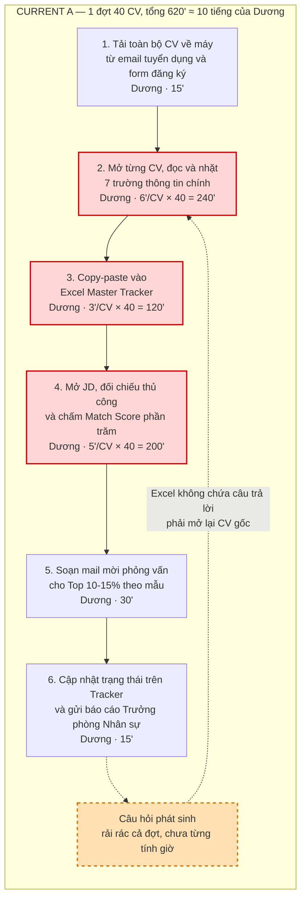
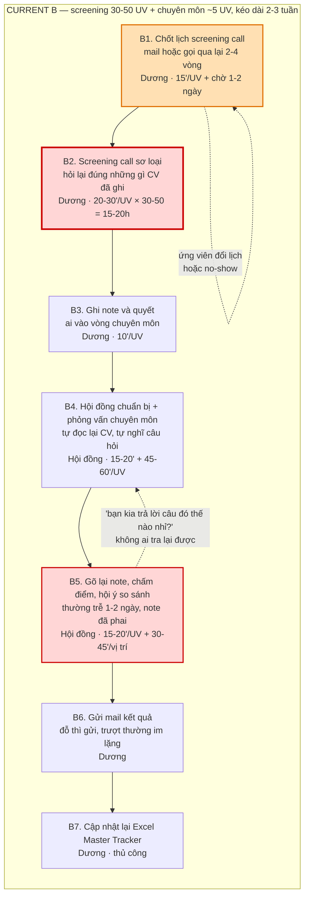
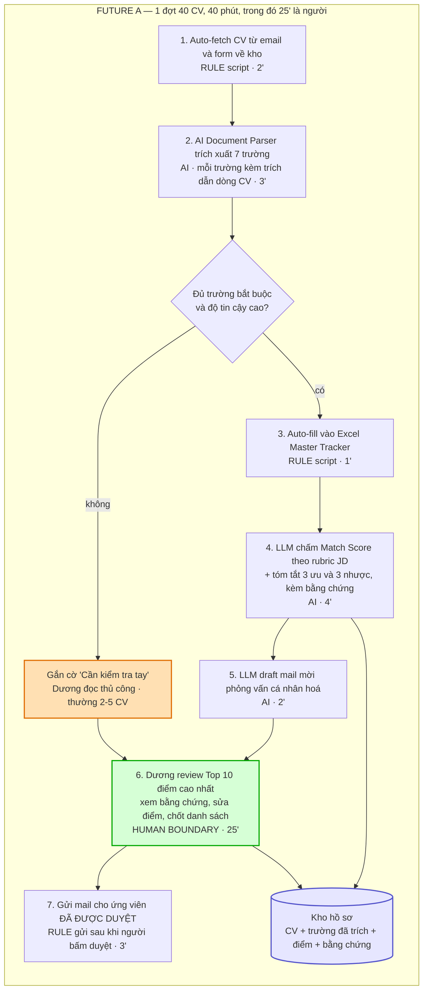
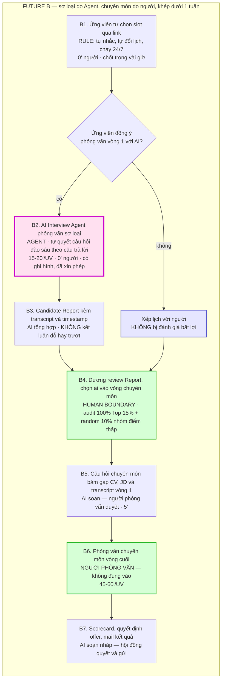
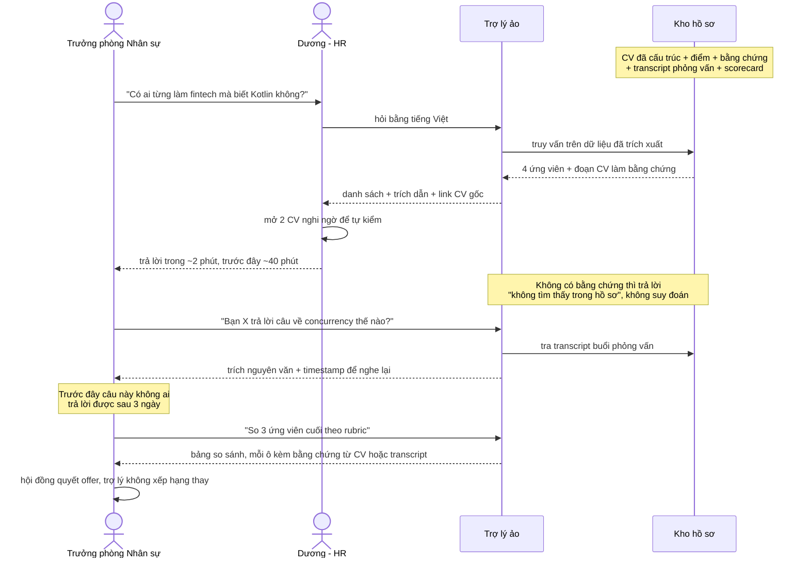

# Group Report — Day 02

## Thành viên nhóm

| STT | Họ và tên | Mã học viên | Vai trò trong nhóm |
|-----|-----------|-------------|--------------------|
| 1   |  Đinh Lê Hoàng Danh         | 2A202601890 |         Thành viên           |
| 2   |   Lưu Nhân Triệu Dương        |       2A202601695      |            Thành viên        |
| 3   |     Nguyễn Văn Hiếu      |         2A202601831    |          Thành viên          |
| 4   |    Nguyễn Lê Minh       |      2A202601573       |          Leader          |
## Bài toán nhóm chọn

**Hệ thống hỗ trợ tuyển dụng theo đợt** cho Dương (HR Recruiter) và Trưởng phòng Nhân sự — giai đoạn A: sàng lọc CV, giai đoạn B: vòng phỏng vấn.

| Mục | Nội dung |
|---|---|
| Candidate được chọn | #6 — Trích xuất CV, cập nhật tracker, so sánh với JD và chấm Match Score |
| Người kể / actor chính | Dương — HR Recruiter, công ty ~150 người, mỗi đợt 30-50 CV |
| Baseline đã đo | 620'/đợt 40 CV cho giai đoạn A; độ trễ phản hồi ứng viên 3-5 ngày |
| Quyết định cuối | **Go** cho No AI + Rule điều phối + Workflow (13/14 bước) · **Not Yet** cho AI Interview Agent (B2) |

## Mục lục

| Phần | Nội dung | Tương ứng worksheet |
|---|---|---|
| [Phần 1](#phần-1--hội-tụ-nhóm-từ-12-candidates-về-1-phase-3) | Nhật ký hội tụ: 12 candidates → cluster → shortlist → chọn 1 | Phase 3 |
| [Phần 2](#phần-2--kiểm-chứng-nhanh--research-giải-pháp-phase-4) | Kiểm chứng nhanh + research giải pháp đã có | Phase 4 |
| [Phần 3](#phần-3--workflow-trướcsau--problem-statement-v0-phase-5) | Workflow trước/sau, fallback, pilot, Problem Statement v0 | Phase 5 |
| [Phần 4](#phần-4--rule--workflow--agent--quyết-định-cuối-phase-6) | Rule / Workflow / Agent, Problem Statement v1, quyết định cuối | Phase 6 |

---

# Phần 1 — Hội tụ nhóm: từ 12 candidates về 1 (Phase 3)

Nhóm 4 người mang vào 12 candidate problems. Không vote ngay, mà đi qua 4 bước: trình bày top 3 → gom trùng thành cluster → shortlist → chấm nhanh và đồng thuận chọn 1 candidate.

### Bước 1.1 — 12 candidate problems được trình bày

|  # | Người đưa ra | Candidate problem                                                                            | Người gặp vấn đề                                    | Điểm nghẽn                                                                                                                   | Cảm nhận nhanh                                                                                                                                                         |
| -: | ------------ | -------------------------------------------------------------------------------------------- | --------------------------------------------------- | ---------------------------------------------------------------------------------------------------------------------------- | ---------------------------------------------------------------------------------------------------------------------------------------------------------------------- |
|  1 | **Danh**     | Đọc slides/docs AIC, tổng hợp framework và phương pháp để giao task cho team, báo cáo mentor | Danh – Team Leader và các thành viên trong team     | Mất gần **1 ngày** để đọc, chọn lọc và tổng hợp tài liệu thủ công                                                            | **Rất phù hợp AI Workflow/Agent** vì đầu vào và đầu ra rõ. Cần kiểm tra khả năng xử lý nhiều định dạng tài liệu không đồng nhất                                        |
|  2 | **Danh**     | Xem lại record tập huấn AIC 2026 và tóm tắt nội dung quan trọng cho team                     | Danh – Team Leader và toàn bộ thành viên trong team | Video dài, không thể xem trực tiếp; xem lại và ghi chú thủ công tốn nhiều thời gian                                          | **Phù hợp AI Workflow** sử dụng speech-to-text và tóm tắt. Rủi ro nằm ở chất lượng âm thanh và thuật ngữ chuyên ngành                                                  |
|  3 | **Danh**     | Quản lý chi tiêu chung và chia bill hằng ngày giữa những người ở cùng                        | Danh và các bạn ở chung                             | Quên ghi bill, nhiều người trả trước, khó đối soát và chia tiền cuối tháng                                                   | Có thể dùng **Rule-based app kết hợp OCR**, nhưng cần xác định AI có thực sự cần thiết hay chỉ cần quy trình nhập liệu chuẩn                                           |
|  4 | **Dương**    | Tự động tạo và đăng video ngắn từ TikTok Livestream lên Facebook                             | Dương – Media Creator và người theo dõi Fanpage     | Tua video dài để tìm highlight; sau đó cắt clip, thêm headline, viết caption và đăng bài thủ công                            | **AI Workflow tiềm năng cao**, tiết kiệm thời gian hằng ngày. Tuy nhiên chất lượng chọn highlight vẫn cần Dương kiểm duyệt                                             |
|  5 | **Dương**    | Trích xuất và chuyển đổi dữ liệu báo cáo kế toán tuần từ email vào Excel Template            | Dương – Kế toán viên, Kế toán trưởng và Giám đốc    | Nhặt số liệu từ nhiều file, chuẩn hóa định dạng, điền lại template và viết nhận xét biến động                                | **Workflow kết hợp Rule và AI** khá khả thi. Phần số liệu cần validation chặt và human review vì yêu cầu độ chính xác cao                                              |
|  6 | **Dương**    | Trích xuất CV, cập nhật tracker, so sánh với JD và chấm Match Score                          | Dương – HR Recruiter, Trưởng phòng HR và ứng viên   | Đọc 30–50 CV, nhập dữ liệu và đánh giá mức độ phù hợp thủ công, mất khoảng **8–10 tiếng/đợt**                                | **AI Workflow có tác động lớn**, nhưng AI chỉ nên hỗ trợ xếp hạng và giải thích; quyết định tuyển dụng cần do con người thực hiện để hạn chế thiên lệch                |
|  7 | **Hiếu**     | Tổng hợp, làm sạch và gán nhãn thủ công tập dữ liệu hình ảnh                                 | Thành viên team AI/NCKH phụ trách chuẩn bị dữ liệu  | Gán nhãn hoặc khoanh vùng từng ảnh, mất **2–5 phút/ảnh** và kéo dài **1–2 tuần/đợt**                                         | **AI Workflow rất phù hợp** để đề xuất nhãn và bounding box. Human review vẫn bắt buộc; cần xây dựng tiêu chuẩn đánh giá độ chính xác của nhãn AI                      |
|  8 | **Hiếu**     | Onboarding thành viên mới vào codebase hoặc dự án lớn                                        | Thành viên mới, Mentor và Senior trong team         | Người mới mất nhiều thời gian đọc tài liệu rời rạc, dò cấu trúc và luồng code; Senior phải trả lời câu hỏi lặp lại           | **AI Codebase Assistant/RAG có tiềm năng cao**, nhưng cần giới hạn phạm vi dữ liệu, kiểm soát hallucination và bảo mật source code                                     |
|  9 | **Hiếu**     | Tổng hợp tin nhắn, thông báo và Q&A trên Discord khóa học                                    | Học viên, Mentor và Teaching Assistant              | Phải cuộn và lọc hàng trăm tin nhắn rời rạc, mất **30–60 phút/ngày**, dễ bỏ sót thông báo                                    | **Phù hợp AI Workflow/Bot** để tạo daily digest và FAQ. Cần bảo đảm quyền truy cập Discord và luôn đính kèm link tin nhắn gốc để kiểm chứng                            |
| 10 | **Minh**     | Viết test case thủ công và chạy lại regression test sau mỗi bản build                        | QA/Tester; gián tiếp là Developer đang chờ kết quả  | Vòng lặp chạy test thủ công sau mỗi lần Dev sửa và build lại; dự án khoảng 200 case có thể mất nhiều ngày                    | Nên kết hợp **AI Workflow và test automation**. AI phù hợp để draft test case và phân tích lỗi; phần regression lặp lại nên ưu tiên Playwright/Cypress thay vì dùng AI |
| 11 | **Minh**     | Review code hoặc Pull Request do AI hay thành viên khác viết                                 | Developer Reviewer, tác giả PR và Tech Lead         | Reviewer phải tự dựng lại ý định của tác giả trước khi kiểm tra logic; diff dài khiến thời gian review tăng                  | **AI Workflow hữu ích** để tóm tắt diff, ý định và vùng rủi ro. Tuy nhiên người review vẫn phải chịu trách nhiệm approve                                               |
| 12 | **Minh**     | Giảng viên không biết sinh viên đang không hiểu bài cho đến khi có bài kiểm tra              | Giảng viên và sinh viên đang bị mất kiến thức nền   | Thiếu tín hiệu phản hồi trong lớp; khoảng cách từ lúc sinh viên không hiểu đến lúc giảng viên phát hiện kéo dài **3–6 tuần** | Trước hết nên dùng **No-AI process fix** như exit ticket hoặc quiz ẩn danh. AI chỉ cần thiết khi lớp đông, để phân cụm lỗi sai và hiểu nhầm phổ biến                   |

### Bước 1.2 — Gom trùng / cluster

Nhóm gom theo **dạng công việc**, không gom theo lĩnh vực. Lý do: hai bài khác ngành nhưng cùng dạng thì giải giống nhau, còn hai bài cùng ngành mà khác dạng thì không học được gì của nhau.

| Cluster | Candidates included | Pattern chung | Ghi chú |
|---|---|---|---|
| **A — Trích xuất có schema**<br>(input lộn xộn → bảng có cột cố định) | #3 (bill), #5 (báo cáo kế toán), #6 (CV → tracker) | Đầu vào là file/ảnh/email không đồng nhất, đầu ra là **các trường đã biết trước**. Mơ hồ thấp: đúng/sai từng trường kiểm được ngay | Dạng dễ đo đúng-sai nhất trong cả 12 bài. Đây là vùng máy làm tốt hơn người, và cũng là vùng đã có nhiều lời giải sẵn |
| **B — Tóm tắt nguồn dài cho người ra quyết định** | #1 (slides/docs AIC), #2 (record tập huấn), #8 (onboarding codebase), #9 (Discord digest), #11 (review PR) | Đầu vào rất dài, đầu ra là một bản tóm tắt để người khác đọc rồi quyết. **Không có đáp án đúng duy nhất** | Cluster đông nhất — 5/12 bài. Nhưng cũng là cluster khó đo nhất: "tóm tắt tốt" là gì thì cả nhóm không định nghĩa được trong 30 phút |
| **C — Đánh giá / xếp hạng theo tiêu chí không viết ra** | #6 (Match Score), #7 (gán nhãn ảnh), #10 (viết test case từ mô tả tính năng) | Người áp một bộ tiêu chí đang nằm trong đầu mình lên từng đơn vị. Kết quả **không tái lập được**: hôm nay chấm khác hôm qua, người này chấm khác người kia | Đây là chỗ nghẽn **chất lượng**, không phải nghẽn giờ. Sửa được chỗ này thì giá trị lớn hơn tiết kiệm vài tiếng gõ liệu |
| **D — Việc lặp có khuôn / tín hiệu đến muộn** | #4 (cắt clip đăng bài), #10 (chạy lại regression), #12 (sinh viên không hiểu bài) | Hoặc là lặp theo một khuôn cố định, hoặc là biết được thì đã trễ | Phần lớn giải bằng **automation thuần hoặc process fix**, không cần AI. #12 là ví dụ rõ nhất: exit ticket giấy giải xong phần lớn |

Bốn điều nhóm rút ra khi cluster xong:

1. **#6 là candidate duy nhất nằm ở hai cluster cùng lúc — A và C.** Nó vừa là trích xuất có schema (7 trường từ CV), vừa là đánh giá theo tiêu chí ẩn (Match Score). Đây là dấu hiệu đầu tiên khiến nhóm nghiêng về nó: bài nào chạm được cả hai dạng thì phần so sánh Rule / Workflow / Agent mới có cái để so, thay vì chỉ có một mức hiển nhiên.
2. **Cluster B đông nhưng yếu.** 5/12 bài nằm ở đây, và cả 5 đều mắc chung một lỗi: không ai nói được "tóm tắt sai thì phát hiện bằng cách nào". Nhóm ghi lại nguyên tắc — **bài mà không định nghĩa được thế nào là sai thì không nên chọn để deep-dive trong một buổi lab.**
3. **Cluster C mới là chỗ đáng tiền, nhưng cả nhóm suýt bỏ qua.** Phản xạ đầu tiên của mọi người là đi tìm bài tốn nhiều giờ nhất. Khi tách C ra thì mới thấy: tăng tốc khâu gõ liệu chỉ làm cho việc **quyết định sai diễn ra nhanh hơn**.
4. **#5 và #6 cùng người, cùng cluster A, nhưng khác nhau ở một điểm quyết định.** #5 sai thì ra số liệu sai — kiểm được bằng đối chiếu tổng. #6 sai thì **loại nhầm một con người, và không ai biết là đã loại nhầm**. Cùng dạng kỹ thuật, khác hẳn về hậu quả.

### Bước 1.3 — Shortlist

Hỏi:

- Có ai trong nhóm hiểu workflow thật đủ sâu không?
- Actor có cụ thể không?
- Bottleneck có phải một bước cụ thể không?
- Impact có thể đo không?
- Có thể vẽ before/after workflow không?
- Có thể so sánh Rule / Workflow / Agent không?
- Có quá rộng cho lab hôm nay không?

| Candidate | Vì sao vào shortlist | Rủi ro / điều chưa rõ |
|---|---|---|
| **#6 — Trích xuất CV, chấm Match Score (Dương, HR Recruiter)** | Người kể là người đang làm hằng đợt, có Excel Master Tracker và hộp mail thật để mở ra ngay tại lab. Workflow tuyến tính, mỗi bước có actor và bấm được số phút. Impact đo bằng phút/CV, giờ/đợt và số ngày phản hồi ứng viên. Nằm ở cả cluster A lẫn C nên so được đủ ba mức Rule / Workflow / Agent | Rủi ro nặng nhất không phải AI chấm sai mà là **AI loại nhầm người và không ai biết** — CV bị chấm thấp oan nằm dưới đáy bảng, không lọt vào phần người review. Chưa rõ mỗi đợt thật sự gọi phỏng vấn bao nhiêu người (5 hay 30-50). Dữ liệu ứng viên là dữ liệu cá nhân, và tuyển dụng là vùng nhạy cảm pháp lý ở nhiều nước |
| **#5 — Báo cáo kế toán tuần từ email vào Excel Template (Dương)** | Cùng dạng trích xuất có schema với #6 nhưng sạch hơn: đầu ra là template cố định, và **đúng/sai kiểm được bằng đối chiếu tổng** — hiếm bài nào có cơ chế tự kiểm rẻ như vậy. Lặp đều đặn mỗi tuần | Yêu cầu độ chính xác gần như tuyệt đối, nên ngưỡng chấp nhận của AI rất khắt khe. Phần lớn công việc thật ra là **Rule + template mapping**, không cần tới AI — chọn bài này thì phần so sánh R/W/A sẽ rất nhạt vì Agent không có lý do tồn tại |
| **#11 — Review code / Pull Request (Minh)** | Cả 4 người đều là actor nên lấy dấu hiệu thật nhanh nhất. Có chỗ dựa nghiên cứu mạnh (DORA 2025, "thuế kiểm chứng"). Đo bằng phút/PR, thời gian PR nằm chờ, số vòng comment | Đang gộp "review" và "debug" làm một. Dễ trượt thành dùng AI để review chính code do AI viết. Metric phút/PR đo nhầm hướng rất dễ: review nhanh hơn mà bug lọt nhiều hơn là tệ đi, và nhóm chưa nghĩ ra chỉ số đối trọng. Chưa ai đo phút/PR trên repo thật |

Ba candidate **suýt vào shortlist** và lý do bị gạt — ghi lại vì đây là chỗ nhóm tranh luận lâu nhất:

- **#7 (gán nhãn ảnh)** — impact lớn nhất về giờ trong cả bảng: 1-2 tuần/đợt. Gạt vì đây là bài đã có cả một ngành công cụ giải (pre-labeling, active learning trong Label Studio, CVAT, Roboflow). Nhóm sẽ dành phần lớn thời gian lab để mô tả lại thứ người khác làm xong rồi.
- **#8 (onboarding codebase)** — pain rất thật và ai cũng dính. Gạt vì đầu ra là "người mới hiểu codebase nhanh hơn", mà nhóm không đo được. Thêm nữa là ràng buộc bảo mật source code làm pilot khó thực hiện trong lab.
- **#9 (Discord digest)** — dễ làm nhất, làm được ngay. Gạt vì impact nhỏ: 30-60 phút/ngày rải cho nhiều người, không ai thật sự đau, và nó nằm trọn trong cluster B khó đo.

Còn lại bị loại vì lý do gọn hơn: **#1, #2** trùng dạng với #8/#9 nhưng khó đo hơn; **#3** là bài Rule + OCR, không cần AI; **#4** phụ thuộc gu cá nhân, không có tiêu chí "highlight tốt" để kiểm; **#10** phần đáng giải là automation thuần (Playwright/Cypress) chứ không phải AI, và nhóm không có ai làm QA; **#12** exit ticket giấy giải xong phần lớn — nhóm giữ lại làm ví dụ đối chiếu cho nguyên tắc "không cần AI vẫn là kết luận tốt".

### Bước 1.4 — Score để đồng thuận

Chấm 1-5. Điểm không cần tuyệt đối; mục tiêu là ép nhóm nói rõ lý do.

| Candidate | Actor rõ | Workflow rõ | Pain có evidence | Impact đo được | Làm trong lab | So sánh R/W/A được | Nhóm hiểu domain | Tổng |
|---|---:|---:|---:|---:|---:|---:|---:|---:|
| **#6 — Trích xuất CV + chấm Match Score** | 5 | 5 | 5 | 5 | **3** | 5 | 5 | **33** |
| #5 — Báo cáo kế toán tuần | 5 | 5 | 4 | 4 | 4 | **2** | 4 | 28 |
| #11 — Review code / PR | 5 | 4 | 4 | **3** | 4 | 4 | 5 | 29 |

Giải thích mấy điểm số dễ gây tranh cãi — phần này quan trọng hơn con số tổng:

- **#6 được 5 ở `Pain có evidence`** vì Dương mở luôn Excel Master Tracker và hộp mail của đợt gần nhất ngay tại chỗ, đếm được 40 dòng và đối chiếu được timestamp. Hai bài kia chỉ có báo cáo ngành và trí nhớ.
- **#6 chỉ được 3 ở `Làm trong lab`** — đây là điểm yếu thật, không phải điểm cho lấy lệ. Bài trải qua nhiều bước, chạm dữ liệu cá nhân, và nếu kéo sang cả vòng phỏng vấn thì rộng hơn hẳn mức làm gọn trong một buổi. Nhóm chấp nhận điểm 3 với điều kiện pilot phải cắt rất mỏng (xem Bước 3.2).
- **#5 bị 2 ở `So sánh R/W/A`** và đó là lý do chính khiến nó thua, dù mọi tiêu chí khác đều mạnh. Bài này gần như thuần Rule: mapping template + validation số. Chọn nó thì phần Rule / Workflow / Agent của Phần 4 sẽ chỉ có một đáp án hiển nhiên, không có gì để cân nhắc.
- **#11 bị 3 ở `Impact đo được`** vì phút/PR rất dễ tối ưu nhầm hướng, và trong thời gian lab nhóm không nghĩ ra chỉ số đối trọng đủ tốt.
- **Điểm số không phải thứ quyết định.** 33 với 29 không phải khoảng cách lớn. Cái thật sự tách #6 ra là câu hỏi ở phần disagreement bên dưới.

Candidate nhóm chọn:

```text
#6 — Trích xuất CV, cập nhật tracker, so sánh với JD và chấm Match Score
     (Problem Card #3 của Dương)

Dương, HR Recruiter, mỗi đợt tuyển nhận 30-50 CV. Với đợt gần nhất (40 CV) bạn ấy
mất khoảng 8-10 tiếng: tải CV về, mở từng file đọc và nhặt 7 trường thông tin, gõ
vào Excel Master Tracker, mở JD ra đối chiếu rồi tự cho một con số Match Score
phần trăm, cuối cùng soạn mail mời phỏng vấn cho nhóm đạt yêu cầu.

Lưu ý: nhóm mới chỉ chốt CANDIDATE PROBLEM, chưa viết Problem Statement. Phạm vi
chính xác (dừng ở sàng lọc CV, hay kéo tiếp sang vòng phỏng vấn) để Phần 3 quyết
sau khi vẽ xong workflow.
```

Vì sao chọn:

```text
1. Người kể là người làm. Đây là candidate duy nhất mà nhóm hỏi "bước này mất bao
   lâu?" và nhận được câu trả lời có số ngay tại chỗ, kèm file Excel thật mở ra
   xem được. 11 bài còn lại đều phải đi hỏi người ngoài mới có số.

2. Workflow vẽ được từ đầu tới cuối. Các bước tuyến tính, mỗi bước một actor rõ,
   input/output rõ. Vẽ trước/sau ra là thấy ngay chỗ nào đổi.

3. Nghẽn không nằm ở chỗ ai cũng đoán. Ai cũng nghĩ nghẽn là "đọc 40 CV mệt".
   Nhưng chỗ đau hơn là bước chấm Match Score: tiêu chí chỉ nằm trong đầu người
   chấm, không viết ra, nên không kiểm được và chính người chấm cũng không tái lập
   được — CV đọc cuối ngày bị chấm khác CV đọc đầu ngày.

4. Đây là bài duy nhất nằm ở hai cluster (A trích xuất + C đánh giá), nên ép nhóm
   phải so cả ba mức. Có phần đúng là Rule (lọc cứng theo số năm kinh nghiệm), có
   phần là Workflow (trích xuất theo schema, soạn nháp mail), và có phần nếu muốn
   thì mới lên tới Agent. Các candidate khác đều nghiêng hẳn về một mức nên phần
   so sánh sẽ nhạt.

5. Có ranh giới người/máy bắt buộc phải nghĩ nghiêm túc. Loại nhầm một ứng viên là
   hậu quả lên một người thật, không phải lên một dòng log. Nhóm muốn bài mà câu
   hỏi boundary không phải câu hỏi cho có.
```

Vì sao không chọn các candidate còn lại:

```text
#11 (review code / PR) — Bài mạnh thứ hai và là bài tôi pitch. Loại vì hai lý do.
Thứ nhất, nó đang là hai bài gộp một (review và debug), tách xong thì phần còn
lại chưa chắc đủ to cho một buổi lab. Thứ hai, metric phút/PR đo nhầm hướng rất
dễ: review nhanh hơn mà bug lọt nhiều hơn là tệ đi, và trong 30 phút nhóm không
nghĩ ra chỉ số đối trọng đủ tốt. Bài này đáng làm, nhưng đáng làm ở chỗ có repo
và có dữ liệu thật, không phải ở đây.

#5 (báo cáo kế toán tuần) — Loại dù điểm sát nút. Bài này gần như thuần Rule:
mapping template cộng validation số. Nếu chọn, phần Rule/Workflow/Agent của
Phần 4 chỉ còn một đáp án hiển nhiên. Nhóm ghi lại đây là bài NÊN LÀM THẬT ở
công ty Dương, chỉ là không phải bài để phân tích trong lab hôm nay.

#7 (gán nhãn ảnh) — Impact lớn nhất bảng (1-2 tuần/đợt) nhưng đã có cả một ngành
công cụ giải (pre-labeling, active learning). Nhóm sẽ chỉ mô tả lại thứ người
khác làm xong rồi.

#1, #2, #8, #9 (tổng hợp docs, tóm tắt record, onboarding codebase, Discord
digest) — Cùng cluster B. Loại cả cụm vì không bài nào trả lời được câu "tóm tắt
sai thì phát hiện bằng cách nào". Không định nghĩa được thế nào là sai thì không
đo được cải thiện.

#10 (test case + regression) — Không ai trong nhóm làm QA, mọi số đều đi mượn.
Phần chạy lại regression đúng ra nên giải bằng automation thuần chứ không phải AI.

#12 (sinh viên không hiểu bài) — Exit ticket giấy 5 phút cuối buổi giải được phần
lớn bottleneck với chi phí gần bằng không. Chọn bài này rồi gắn AI vào là đi ngược
nguyên tắc "problem first". Nhóm giữ lại làm ví dụ đối chiếu.

#3 (chia bill) và #4 (cắt clip từ livestream) — #3 chỉ cần Rule + OCR. #4 phụ
thuộc gu cá nhân, không có tiêu chí "highlight tốt" để kiểm đúng/sai.
```

Nếu có disagreement, nhóm xử lý thế nào:

```text
Có hai bất đồng thật, không phải bất đồng cho có.

BẤT ĐỒNG 1 — #6 hay #11.
Tôi (Minh) giữ #11 vì cả 4 người đều là actor, kiểm chứng nhanh nhất, không phải
đi hỏi ai. Hiếu phản biện đúng chỗ đau: "chính vì cả nhóm đều là dev nên sẽ tự
trả lời thay người dùng và không ai kiểm được, còn #6 buộc phải đi hỏi mới biết."

BẤT ĐỒNG 2 — #6 hay #5, hai bài cùng của Dương.
Danh giữ #5 vì nó sạch hơn: sai là biết ngay nhờ đối chiếu tổng, không có vùng
xám. Dương phản đối chính bài của mình: "#5 sai thì em dò lại được trong 10 phút.
#6 sai thì em không bao giờ biết là mình đã loại nhầm ai."

CÁCH XỬ LÝ: không vote. Nhóm đặt hai câu hỏi quyết định.

Câu 1 — "candidate nào mà trong 30 phút tới nhóm lấy được số THẬT, không phải số
đi mượn?" #6 có Excel Master Tracker và hộp mail đợt gần nhất, mở ra xem ngay
được. #11 phải đi đo phút/PR trên repo mà chưa ai từng ghi lại. #5 có file nhưng
nằm ở máy công ty, hôm nay không truy cập được.

Câu 2 — "candidate nào mà làm sai gây hậu quả lên một CON NGƯỜI?" Chỉ #6. Và
chính điều làm #6 rủi ro hơn lại là điều khiến nó đáng phân tích hơn: bài mà câu
hỏi boundary có trọng lượng thật.

Nhóm chốt #6, và ghi rõ ba điều để không tự lừa mình:
- Điểm 3 của #6 ở "làm trong lab" là điểm yếu thật, phải giữ pilot thật mỏng.
- #11 được giữ nguyên làm backup. Nếu validation ở Phần 2 cho thấy pain của #6
  nhỏ hơn Dương nghĩ, nhóm quay về #11 chứ không cố cứu #6.
- #5 được ghi vào phần "nên làm thật nhưng không làm trong lab" để Dương mang về
  công ty, không bỏ đi.

ĐIỀU KIỆN QUAY ĐẦU, ghi thành câu cụ thể TRƯỚC khi sang Phần 2: nếu phỏng vấn 2
HR ngoài nhóm cho thấy họ mất dưới 2 tiếng mỗi đợt, hoặc công ty họ đã có ATS làm
gần hết phần này, thì #6 bị hạ và nhóm đổi sang #11.
```

---

# Phần 2 — Kiểm chứng nhanh + Research giải pháp (Phase 4)

### Bước 2.1 — Quick validation

Nhóm làm cả ba: 2 interview HR ngoài nhóm và mở trực tiếp dữ liệu thật của Dương.

> Quy ước ghi số trong phần này: **[đo]** là số bấm giờ hoặc đếm được từ file thật. **[nhớ lại]** là số người trả lời tự ước lượng, sai số có thể lớn. Không có số nào ở đây được lấy từ AI.

**Interview 1 — Dương (trong nhóm, HR Recruiter công ty ~150 người)**

- Lần gần nhất: đợt tuyển 2 vị trí Mobile Dev, kết thúc cách đây 3 tuần, 40 CV. **[đo]** — mở Excel Master Tracker đếm được 40 dòng.
- Workflow: 6 bước như card mô tả. Bấm giờ lại trên 3 CV ngay tại lab: đọc + nhặt thông tin trung bình **6'/CV**, gõ vào Excel **3'/CV** **[đo, mẫu nhỏ]**.
- Bước khó chịu nhất — và đây là chỗ nhóm hỏi sai lúc đầu: nhóm đoán là "đọc CV mệt", Dương nói không, chỗ khó chịu nhất là **chấm Match Score**, vì "không biết mình chấm đúng không, hôm sau chấm lại có khi ra số khác".
- Chi tiết không ai hỏi mà Dương tự kể: Trưởng phòng Nhân sự hay hỏi ad-hoc kiểu *"có ai từng làm fintech không?"*, và Excel không trả lời được nên phải mở lại CV gốc. **Đây là nghẽn thứ ba, hoàn toàn không có trong card.**

**Interview 2 — HR ngoài nhóm (công ty ~600 người, có ATS)**

- Có ATS nên phần trích xuất thông tin đã tự động. Nhưng phần chấm phù hợp vẫn tay: *"ATS chỉ lọc được từ khoá, nó không biết 3 năm React ở agency khác 3 năm React ở product."* **[nhớ lại]**
- Ước lượng vẫn mất **3-4 tiếng/đợt** cho phần đọc và xếp hạng. **[nhớ lại]**
- Câu quan trọng nhất thu được: *"Chỗ mất thời gian nhất bây giờ không phải CV, mà là gọi screening. Hỏi lại đúng những thứ CV đã ghi."*

**Interview 3 — HR freelance tuyển thuê cho startup**

- Không dùng ATS, chỉ Google Sheet. Xác nhận đúng workflow của Dương. **[nhớ lại]**
- Phản hồi ứng viên trượt: *"gần như không gửi, không đủ thời gian"* — trùng với bước B6 mà Phần 3 vẽ.

**Ba điều validation làm nhóm phải sửa lại problem — ghi rõ để không giấu:**

1. **Nhóm hỏi sai câu ở lần đầu.** Nhóm đi vào với giả định "nghẽn là đọc 40 CV mất 6 tiếng". Người làm thật nói chỗ khó chịu là 200 phút chấm Match Score, vì nó không tái lập được. Nghẽn giờ và nghẽn chất lượng là hai thứ khác nhau, và nhóm đã gộp nhầm.
2. **Phần dễ khoe nhất lại là phần đã có lời giải sẵn.** Trích xuất CV là bài toán ATS đã làm nhiều năm. Nếu nhóm chỉ dừng ở đó thì bài này không có gì mới.
3. **Câu chưa trả lời được, và nó quan trọng hơn mọi số đã có:** công ty Dương thật sự gọi screening bao nhiêu người mỗi đợt — 5 hay 30-50? Card nói mail mời cho Top 10-15% (~5 người), nhưng Phần 4 lại ghi 30-50 người. Nếu là 5 thì **toàn bộ lý do tồn tại của AI Interview Agent sụp**. Nhóm ghi đây là câu hỏi số 1 phải đi hỏi Dương trước khi làm pilot, không phải câu để đoán.

### Bước 2.2 — Research giải pháp đã có

| Nguồn / tool / case | Link | Họ giải quyết phần nào? | Điểm mạnh | Khoảng trống / rủi ro | Bài học cho nhóm |
|---|---|---|---|---|---|
| **ATS phổ thông (Greenhouse, Ashby, Lever)** | [greenhouse.com](https://www.greenhouse.com/) · [ashbyhq.com](https://www.ashbyhq.com/) | Bước 1-3 và bước 6: nhận CV, lưu hồ sơ, theo dõi trạng thái, thay thế Excel Master Tracker | Đã trưởng thành, có sẵn báo cáo funnel, không phải tự xây | Phần **đánh giá độ phù hợp** vẫn là người. HR ở interview 2 nói thẳng: ATS chỉ lọc từ khoá, không phân biệt được 3 năm React ở agency với 3 năm React ở product | **Đây là phương án No-AI phải so trước.** Nếu vấn đề chỉ là bước 1-3 thì mua ATS là xong, và cả bài này không cần tồn tại. Nhóm phải chứng minh nghẽn nằm ở bước 4 |
| **Resume parsing API (Affinda, Rchilli, Sovren/Textkernel)** | [affinda.com/resume-parser](https://www.affinda.com/resume-parser) | Đúng bước 2-3: đọc PDF/Word/ảnh → trả về JSON có schema | Đã có sẵn schema chuẩn, xử lý được nhiều định dạng, không cần nhóm tự làm phần này | CV dạng ảnh và layout nhiều cột vẫn là điểm gãy — đúng thứ Dương đã ghi ở bước 1. Parse hỏng mà không báo là hỏng âm thầm | Không tự viết parser. Nhưng **bắt buộc có cổng độ tin cậy**: parse điểm thấp phải gắn cờ đẩy sang người, không được để trôi xuống bước chấm điểm |
| **Metaview — AI ghi và tóm tắt phỏng vấn** | [metaview.ai](https://www.metaview.ai/) | Bước B5: ghi note phỏng vấn, tóm tắt, sinh nhận xét có cấu trúc | Giải đúng cái nghẽn "note gõ lại sau 2 ngày đã méo". Người vẫn hỏi, máy chỉ ghi — ranh giới rất sạch | Không đụng tới B1 (chốt lịch) và không tự phỏng vấn. Vẫn tốn nguyên giờ người phỏng vấn | Mô hình boundary đáng học nhất trong cả bảng: **AI đứng cạnh cuộc phỏng vấn, không đứng thay.** Nhóm nên so mức này với mức Agent trước khi chọn |
| **HireVue — phỏng vấn AI vòng 1** | [hirevue.com](https://www.hirevue.com/) | Đúng bước B2 mà nhóm định giao cho Agent: phỏng vấn sơ loại không đồng bộ, chấm điểm ứng viên | Có thật, có khách hàng lớn, chứng minh mức Agent là khả thi về mặt kỹ thuật | Vướng kiện tụng và tranh cãi về bias suốt nhiều năm; HireVue đã **bỏ tính năng phân tích nét mặt** năm 2021 sau phản ứng dữ dội | Nếu làm Agent thì **tuyệt đối không chấm qua giọng nói, nét mặt, ngoại hình.** Chỉ chấm nội dung câu trả lời, và mọi kết luận phải trỏ về được đoạn transcript gốc |
| **Case Amazon bỏ công cụ tuyển dụng AI (2018)** | [Reuters](https://www.reuters.com/article/us-amazon-com-jobs-automation-insight-idUSKCN1MK08G) | Không giải được gì — đây là case thất bại | — | Model học từ 10 năm CV lịch sử nên tự học được thiên lệch giới, hạ điểm CV có chữ "women's". Amazon bỏ hẳn dự án | **Không train/tinh chỉnh trên dữ liệu tuyển dụng lịch sử của công ty.** Chấm theo rubric viết ra tay, không chấm theo "ai giống người đã được nhận trước đây" |
| **NYC Local Law 144 — bắt buộc audit thiên lệch với công cụ tuyển dụng tự động** | [nyc.gov](https://www.nyc.gov/site/dca/about/automated-employment-decision-tools.page) | Không phải tool, là ràng buộc pháp lý | — | Bắt buộc audit bias độc lập hằng năm và phải thông báo cho ứng viên. Chỉ áp dụng ở NYC, **không ràng buộc công ty Dương ở VN** | Kể cả không bị luật ràng buộc, nhóm vẫn nên lấy hai yêu cầu này làm chuẩn tự đặt: **báo trước cho ứng viên** và **kiểm tra định kỳ nhóm bị chấm thấp** |
| **EU AI Act — tuyển dụng nằm trong nhóm rủi ro cao (Annex III)** | [artificialintelligenceact.eu/annex/3](https://artificialintelligenceact.eu/annex/3/) | Ràng buộc pháp lý | — | Hệ thống dùng để sàng lọc hồ sơ và đánh giá ứng viên bị xếp **rủi ro cao**, kèm yêu cầu về giám sát của con người và minh bạch. VN chưa có quy định tương đương | Đây là tín hiệu về hướng đi chung: **giám sát của con người là yêu cầu mặc định của loại bài này**, không phải tính năng nhóm tự nghĩ ra cho đẹp |
| **Công cụ tự chọn lịch (Calendly, GoodTime)** | [calendly.com](https://calendly.com/) | Đúng bước B1: chốt lịch phỏng vấn | Rẻ, triển khai trong một buổi, **không cần AI** | Không giải quyết gì ngoài lịch | **Quick win rẻ nhất trong cả bài.** Nghẽn độ trễ ở B1 không cần một dòng AI nào. Nhóm phải nói rõ điều này, nếu không sẽ bị hỏi vì sao dùng AI cho việc mà link đặt lịch giải xong |

**Nhóm đã kiểm nguồn thế nào:** 8 link ở trên đều mở được và đọc trực tiếp tại lab. Riêng case Amazon và HireVue bỏ tính năng phân tích nét mặt, nhóm đọc bản tin gốc chứ không lấy qua tóm tắt của AI. Con số về thị phần ATS hay "AI giảm X% thời gian tuyển" mà AI đưa ra khi nhóm hỏi thêm đã **bị bỏ hết** vì không truy được về nguồn sơ cấp.

**Ba bài học kéo về bài toán nhóm:**

1. **Phần nhóm định làm đã có người làm, phần chưa ai làm tốt mới là phần đáng làm.** Trích xuất CV: giải rồi (ATS + parsing API). Chấm điểm **có rubric tường minh và có trích dẫn bằng chứng để người kiểm lại được**: đây mới là khoảng trống, và cũng đúng chỗ Dương nói khó chịu nhất. Nhóm dời trọng tâm về đây.
2. **Ranh giới người/máy không phải phần trang trí cuối slide.** Case Amazon và tranh cãi quanh HireVue cho thấy loại bài này hỏng theo cách âm thầm: nó không báo lỗi, nó chỉ xếp sai người xuống đáy bảng. Vì thế pilot **phải chạy song song** — một đợt sàng cả bằng tay lẫn bằng hệ thống rồi so hai danh sách — chứ không thể chỉ nhìn output của hệ thống rồi kết luận nó chạy tốt.
3. **Chỗ rẻ nhất phải làm trước.** Trước khi bàn tới Agent, đặt link tự chọn lịch cho bước B1 và viết rubric chấm điểm ra giấy cho bước 4. Hai việc này không cần AI, làm được ngay tuần sau, và nếu chúng giải xong phần lớn nghẽn thì kết luận đúng của bài là **Not Yet** chứ không phải Go.

---

# Phần 3 — Workflow trước/sau + Problem Statement v0 (Phase 5)

> Candidate nhóm chọn: **#6 trong bảng Phần 1 — Problem Card #3 của Dương, tuyển dụng theo đợt.** **Dương** (HR Recruiter) mất 8-10 tiếng mỗi đợt 30-50 CV để đọc, nhặt thông tin vào Excel Master Tracker, chấm Match Score với JD và soạn mail mời phỏng vấn — rồi sau đó còn cả vòng phỏng vấn kéo dài thêm 2-3 tuần nữa.

### Bước 3.0 — Nhóm đã rethinking gì so với Problem Card

#### Rethinking 1 — "9 tiếng" không phải một nghẽn, mà là ba

Card ban đầu gộp bước 2, 3, 4 thành một bottleneck 560' (~9,3 tiếng). Khi vẽ kỹ ra thì đó là **ba loại nghẽn khác nhau, phải giải bằng ba cách khác nhau**:

| Loại nghẽn | Nằm ở bước | Bản chất | Giải bằng gì |
|---|---|---|---|
| Nghẽn khối lượng | 2 + 3 (đọc, nhặt, gõ Excel) | **360' (6h)** — lặp lại, mơ hồ thấp, chỉ là đọc văn bản rồi điền vào 7 trường cố định | Trích xuất có schema — máy làm tốt hơn người |
| Nghẽn khối lượng **và** chất lượng | 4 (chấm Match Score) | **200' (3,3h)** — vừa tốn giờ, vừa là chỗ tiêu chí chỉ nằm trong đầu người chấm, không viết ra nên không tái lập được | Rubric tường minh + AI chấm kèm trích dẫn, người vẫn duyệt |
| Nghẽn truy vấn | phát sinh quanh bước 5 - 6 | Excel chỉ trả lời được đúng các cột đã có sẵn | **Trợ lý ảo** |

Nghẽn thứ ba là cái card cũ bỏ sót, và cũng là lý do nhóm thêm trợ lý ảo. Mỗi lần Trưởng phòng Nhân sự hỏi *"vì sao bạn này 80%?"*, *"có ai từng làm fintech không?"*, *"bạn nào biết cả Kotlin lẫn Swift?"* thì Excel không trả lời được — Dương phải mở lại CV gốc và đọc lại. Đây là công việc **không nằm trong 620 phút đã đo**, nó rơi rải rác suốt đợt nên trước đây không ai tính vào.

Điểm quan trọng khi sửa lại số: bước 4 tốn 200' chứ không phải một khoản nhỏ. Nghĩa là **chấm Match Score vừa là nghẽn giờ vừa là nghẽn chất lượng** — nó là bước đáng can thiệp nhất trong cả giai đoạn A, chứ không phải bước phụ đi kèm bước 2-3.

#### Rethinking 2 — Card dừng ở mail mời phỏng vấn, nhưng chi phí thật nằm sau đó

Card cũ coi bước 6 "soạn mail mời phỏng vấn" là điểm kết. Thực tế đó mới là **giữa** quy trình. Sau nó còn: chốt lịch, chuẩn bị câu hỏi, phỏng vấn, gõ lại note, hội ý so sánh, gửi kết quả.

| | Giai đoạn A — Sàng lọc CV | Giai đoạn B — Phỏng vấn |
|---|---|---|
| Ai làm | Dương, 1 người | Dương + Trưởng phòng Nhân sự + tech lead |
| Giờ người/đợt | ~10h | ~20h (2h × 10 ứng viên) |
| Giá của giờ đó | Giờ HR | Giờ của người đắt tiền hơn nhiều |
| Độ trễ | Trong 1-2 ngày | 2-3 tuần |

Hệ quả của việc vẽ tiếp phần này: **bottleneck thật của cả funnel không phải là giờ HR, mà là time-to-hire.** Ứng viên giỏi thường đang có 2-3 offer song song. Tối ưu giai đoạn A từ 10h xuống 45' mà giai đoạn B vẫn kéo 3 tuần thì tổng thời gian tuyển gần như không đổi, và ứng viên tốt nhất vẫn mất về tay công ty phản hồi nhanh hơn.

Nghẽn thứ tư vì thế là **nghẽn độ trễ** ở bước chốt lịch và bước gõ lại note sau phỏng vấn.

#### Rethinking 3 — Giới hạn phạm vi, để không tự động hoá nhầm chỗ

Hệ thống có **hai thành phần AI khác hẳn nhau**, đừng gộp làm một khi trình bày:

| | Trợ lý ảo (nội bộ) | AI Interview Agent |
|---|---|---|
| Nói chuyện với ai | Dương, Trưởng phòng Nhân sự | Ứng viên |
| Làm gì | Hỏi-đáp trên kho hồ sơ, soạn nháp | Phỏng vấn sơ loại vòng 1, tự hỏi đào sâu |
| Mức | Workflow (đọc + soạn nháp) | **Agent** (tự quyết câu hỏi tiếp theo) |
| Rủi ro | Trả lời sai → người tự kiểm | Cao: đối diện trực tiếp với ứng viên thật |

- Trợ lý ảo **không nói chuyện với ứng viên**. Nó chỉ đọc và soạn nháp cho người trong công ty.
- AI Interview Agent **chỉ làm vòng sơ loại**. Vòng phỏng vấn chuyên môn cuối vẫn là người, và quyết định tuyển vẫn là người. Đây là ranh giới nhóm chốt ngay khi vẽ workflow, và Phần 4 sẽ giữ nguyên.
- Bài giờ trải 6 + 7 = **13 bước qua 2 giai đoạn — rộng hơn mức làm gọn trong một buổi lab.** Nhóm giữ Problem Statement ở phạm vi cả funnel vì bottleneck thật là độ trễ phản hồi, nhưng pilot chỉ cắt vài lát mỏng (xem Bước 3.2, phần pilot).

### Bước 3.1 — Current workflow bản nhóm

#### Giai đoạn A — Sàng lọc CV (620 phút ≈ 10 tiếng/đợt 40 CV)



Khối A7 và mũi tên đứt nét là phần nhóm bổ sung so với card: mọi câu hỏi không nằm sẵn trong cột Excel đều đẩy Dương quay lại bước 2. Nó không nằm trong 620 phút đã đo.

| Bước | Actor | Input | Output | Thời gian/tần suất | Ghi chú |
|---|---|---|---|---|---|
| 1 | Dương | Email tuyển dụng, form đăng ký | Thư mục ~40 CV (PDF, Word, ảnh) | **15'** | Định dạng lộn xộn; CV dạng ảnh hoặc layout cột rất khó đọc máy |
| 2 | Dương | 1 file CV | Họ tên, SĐT, email, số năm KN, kỹ năng cứng/mềm, học vấn, lương kỳ vọng | 6'/CV × 40 = **240'** | **Bottleneck khối lượng.** Quá tải nhận thức: CV đọc cuối ngày bị đánh giá kém kỹ hơn |
| 3 | Dương | Thông tin vừa nhặt | 1 dòng Excel Master Tracker | 3'/CV × 40 = **120'** | Dễ nhập nhầm số điện thoại và mức lương |
| 4 | Dương | Dòng Excel + JD | Match Score % + Top 10-15% đạt yêu cầu | 5'/CV × 40 = **200'** | **Bottleneck kép.** Vừa tốn giờ nhất sau bước 2, vừa là chỗ đánh giá cảm tính, không có rubric viết ra |
| 5 | Dương | Danh sách đạt yêu cầu | Mail mời phỏng vấn theo mẫu | **30'** | Lặp khuôn, hay sai tên hoặc vị trí do copy nhầm |
| 6 | Dương → Trưởng phòng Nhân sự | Kết quả sàng lọc | Trạng thái trên Tracker + báo cáo sơ bộ | **15'** | Handoff. Mỗi câu hỏi ngược lại là một vòng quay về bước 2 |
| — | Dương | Câu hỏi ad-hoc từ Trưởng phòng Nhân sự | Câu trả lời | Rải rác cả đợt | **Bottleneck truy vấn.** Nhóm bổ sung, chưa nằm trong 620' |

Tổng: 15 + 240 + 120 + 200 + 30 + 15 = **620 phút**. Riêng bước 2 + 3 + 4 = **560 phút (9,3 tiếng)**, đúng như card ghi.

#### Giai đoạn B — Vòng phỏng vấn (nhóm bổ sung, card cũ chưa vẽ)

> **Một mâu thuẫn số liệu chưa giải quyết được.** Card chi tiết nói bước 5 chỉ là *"soạn email mời phỏng vấn cho Top 10-15% ứng viên đạt yêu cầu, 30 phút"* — tức khoảng 5 người, và card không có bước screening call nào. Nhưng khi kể lại workflow ở lab, Dương mô tả một vòng screening call cho phần lớn ứng viên, *"30-50 người, mất 15-20 tiếng/đợt"*. Hai con số này không thể cùng đúng.
>
> Phần 3 vẽ theo phương án có screening call rộng, vì đó là phương án **tốn kém hơn** — vẽ theo nó thì thấy được toàn bộ chi phí, còn nếu thực tế nhẹ hơn thì chỉ việc bỏ bớt. Nhưng phải nói rõ hệ quả: nếu thực tế chỉ phỏng vấn 5 người thì **cả lý do tồn tại của AI Interview Agent sụp đổ** — bỏ 5-6 tuần xây phần rủi ro nhất hệ thống để tiết kiệm 5 buổi gọi là lỗ. Đây là câu hỏi phải đi hỏi Dương, không phải câu hỏi để đoán, và Bước 4.3 xử lý nó bằng cách để Agent ở mức **Not Yet** cho tới khi có câu trả lời.

> Các con số còn lại ở giai đoạn B đều là **ước lượng của nhóm, chưa đo thật** — khác với giai đoạn A vốn đã có số bấm giờ.



| Bước | Actor | Input | Output | Thời gian/tần suất | Ghi chú |
|---|---|---|---|---|---|
| B1 | Dương ↔ ứng viên | Danh sách mời + lịch rảnh | Lịch đã chốt | 15'/UV + **chờ 1-2 ngày** | **Bottleneck độ trễ.** Đổi lịch hoặc no-show là làm lại từ đầu |
| B2 | Dương + ứng viên | Câu hỏi sơ loại | Cảm nhận + note ngắn | 20-30'/UV × 30-50 = **15-20h** | **Bottleneck lớn nhất của cả funnel.** Phần lớn nội dung là xác nhận lại thứ CV đã ghi |
| B3 | Dương | Note screening | Danh sách vào vòng chuyên môn | 10'/UV | Quyết định dựa trên trí nhớ về cuộc gọi, không có bản ghi |
| B4 | Hội đồng + ứng viên | CV + JD | Note tay rời rạc | 15-20' chuẩn bị + 45-60' phỏng vấn/UV | Chuẩn bị thường bị bỏ → hỏi lan man. **Vòng này phải giữ cho người** |
| B5 | Hội đồng | Note tay | Điểm, nhận xét, quyết định offer | 15-20'/UV + 30-45'/vị trí, trễ 1-2 ngày | Note viết trễ là note đã méo, nên so sánh trên dữ liệu sai |
| B6 | Dương | Quyết định | Mail kết quả | 5'/người | Ứng viên trượt hầu như không nhận được phản hồi nào |
| B7 | Dương | Kết quả | Excel đã cập nhật | 15'/đợt | Dữ liệu phỏng vấn không quay lại làm giàu cho hồ sơ ứng viên |

Hai điểm nối quan trọng:

- Card đã ghi **"tốc độ phản hồi ứng viên chậm 3-5 ngày khiến ứng viên giỏi nhận lời mời ở công ty khác"**. Đó chính là giai đoạn B nói bằng lời khác, và nó xác nhận bottleneck thật của cả funnel là độ trễ.
- **B2 là lý do duy nhất khiến bài này cần Agent.** Nếu bỏ B2 ra khỏi bài toán thì mọi thứ còn lại đều là Workflow. Vì vậy con số 15-20h ở B2 là con số quan trọng nhất phải kiểm chứng — quan trọng hơn cả 620' của giai đoạn A.

Bottleneck chính:

```text
GIAI ĐOẠN A
Bước 2 + 3 chiếm 360/620 phút — chỗ đau nhất về THỜI GIAN, và là công việc mơ hồ
thấp: đọc một văn bản rồi điền vào 7 trường cố định. Đây là loại việc máy làm tốt.

Bước 4 chiếm 200 phút, đứng thứ hai về giờ, nhưng đứng ĐẦU về mức đáng can thiệp.
Match Score hiện là con số Dương tự cho theo cảm nhận, không có rubric viết ra,
nên không ai kiểm được và chính người chấm cũng không tái lập được. Tệ hơn: 40 CV
đọc liên tục gây quá tải nhận thức, nên CV cuối ngày bị chấm khác CV đầu ngày.
Tăng tốc bước 2-3 mà không đụng bước 4 thì chỉ là sàng lọc sai nhanh hơn.

Nghẽn ẩn: mọi câu hỏi ngoài các cột Excel đều buộc mở lại CV gốc.

GIAI ĐOẠN B
Bước B1 là nghẽn ĐỘ TRỄ, và nó không cần AI để giải — chỉ cần lịch chung và link
tự chọn slot. Đây là quick win rẻ nhất trong cả bài.

Bước B2 là nghẽn CHẤT LƯỢNG thật sự của cả quy trình tuyển. Tuyển sai người không
sinh ra ở khâu đọc CV, nó sinh ra ở buổi phỏng vấn hỏi không đúng chỗ.

Bước B4 là nghẽn KHỐI LƯỢNG thứ hai, và tệ hơn bước 2-3 ở chỗ nó làm hỏng dữ
liệu: note gõ lại sau 2 ngày đã mất chi tiết, nên bước B5 so sánh trên dữ liệu sai.

BOTTLENECK CỦA CẢ FUNNEL
Không phải giờ HR, mà là ĐỘ TRỄ PHẢN HỒI — card đã ghi 3-5 ngày, và cả vòng tuyển
kéo 3-4 tuần. Ứng viên giỏi có 2-3 offer song song. Giảm giai đoạn A từ 620' xuống
40' mà giai đoạn B vẫn 3 tuần thì tổng thời gian tuyển gần như không đổi — và
người tốt nhất vẫn mất.
```

### Bước 3.2 — Future workflow bản nhóm

#### Giai đoạn A — Sàng lọc CV: từ 620 phút xuống 40 phút

Giữ đúng 7 bước trong future workflow của card, chỉ thêm một cổng kiểm tra độ tin cậy giữa bước 2 và 3.



Hai điều nhóm cố ý **không** đưa vào, dù nghe có vẻ hợp lý:

- **Không có bước RULE lọc keyword cứng trước khi chấm điểm.** Chính card đã chỉ ra điểm yếu của ATS: *"dễ loại nhầm các CV trình bày sáng tạo, viết từ đồng nghĩa hoặc dùng layout dạng cột/ảnh"*. Thêm lại một bộ lọc keyword ở đây là mang đúng cái nhược điểm đó vào hệ thống mới. Mọi CV parse được đều đi qua bước chấm điểm; việc loại chỉ xảy ra khi người duyệt ở bước 6.
- **"Auto-send" ở bước 7 không phải AI tự gửi.** Nó là gửi hàng loạt cho danh sách người đã bấm duyệt ở bước 6. Máy không tự chọn ai được nhận mail.

#### Giai đoạn B — Vòng phỏng vấn: từ 2-3 tuần xuống dưới 1 tuần



Bốn thay đổi ở giai đoạn B, xếp theo tỉ lệ lợi ích trên rủi ro:

| Đổi gì | Mức | Lợi ích | Rủi ro |
|---|---|---|---|
| B1: link tự chọn slot | **RULE thuần** | Cắt 1-2 ngày độ trễ mỗi ứng viên. Đánh thẳng vào "phản hồi chậm 3-5 ngày" mà card nêu | Gần như không có |
| B5: câu hỏi bám gap CV-JD-transcript | Workflow | Chỗ **tăng chất lượng** chứ không chỉ tiết kiệm giờ | Câu hỏi lạc đề → người phỏng vấn bỏ, không sao |
| B3: Candidate Report kèm timestamp | Workflow | Lần đầu vòng sơ loại có bản ghi tra lại được, thay vì trí nhớ | Tóm tắt lệch → phải trỏ về timestamp gốc |
| **B2: AI Interview Agent** | **AGENT** | Cắt phần lớn 15-20h screening. Ứng viên phỏng vấn được 24/7, không phải chờ lịch HR | **Cao nhất trong cả bài.** Đối diện trực tiếp với ứng viên thật; sai là sai trước mặt người ngoài công ty |

Đọc bảng này theo đúng thứ tự đó: ba dòng trên gần như không có mặt trái, dòng cuối là dòng phải bảo vệ bằng lập luận. Nếu nhóm chỉ có thời gian làm một thứ, làm B1 trước.

#### Ba mức tự động hoá vòng phỏng vấn — nhóm chọn mức 3, giới hạn ở vòng 1

| Mức | Là gì | Nhóm chọn? |
|---|---|---|
| **1. Tự động hoá QUANH buổi phỏng vấn** | Chốt lịch, soạn câu hỏi, transcript, scorecard, mail kết quả. Người vẫn phỏng vấn | Có, đây là phần nền |
| **2. Sàng lọc sơ bộ bất đồng bộ 1 chiều** | Ứng viên trả lời 3-5 câu hỏi cố định bằng text/video, AI chấm transcript | Bỏ. Không đào sâu được vào câu trả lời mơ hồ, và dễ bị học vẹt kịch bản chuẩn bị sẵn |
| **3. AI Interview Agent phỏng vấn 2 chiều** | AI tự hỏi, tự nghe, tự quyết câu hỏi đào sâu tiếp theo, sinh Candidate Report | **Chọn — nhưng CHỈ cho vòng sơ loại 1** |

Đây là chỗ bài toán thật sự cần Agent chứ không phải Workflow: trong một buổi phỏng vấn, **bước tiếp theo phụ thuộc vào câu trả lời vừa nghe**, không thể viết thành chuỗi cố định.

Nhưng chọn Agent thì phải trả kèm 4 điều kiện, không được bỏ:

```text
1. RANH GIỚI CỨNG. Agent chỉ sơ loại vòng 1. Không tự từ chối, không tự hứa hẹn
   offer, không tự quyết ai vào vòng sau. Nó sinh Candidate Report, người đọc và
   quyết. Ranh giới này phải giữ nguyên khi sang Phần 4, không được nới.

2. PHÁP LÝ. EU AI Act xếp AI dùng trong tuyển dụng vào nhóm rủi ro cao; NYC Local
   Law 144 buộc bias audit hằng năm và phải báo trước cho ứng viên. Việt Nam chưa
   có luật riêng, nhưng Nghị định 13/2023/NĐ-CP vẫn áp cho dữ liệu cá nhân, và ghi
   âm/ghi hình phỏng vấn bắt buộc phải xin phép trước.
   → Nhóm phải tự verify hai nguồn luật nước ngoài này trước khi đưa vào bản nộp.
   Tối thiểu: báo trước cho ứng viên rằng vòng 1 do AI thực hiện.

3. QUYỀN TỪ CHỐI CỦA ỨNG VIÊN. Phải có đường thoát: ứng viên không muốn phỏng vấn
   với AI thì được xếp lịch với người, và KHÔNG bị đánh giá bất lợi vì đã từ chối.
   Không có đường thoát này thì rủi ro mất ứng viên giỏi là rủi ro thật, và nó phá
   đúng cái metric nhóm đang tối ưu.

4. GUARDRAIL NỘI DUNG. Agent không được hỏi về tuổi, giới tính, hôn nhân, thai
   sản, tôn giáo, quê quán, tình trạng sức khoẻ. Cần một bộ chặn chủ đề và một
   vòng review transcript ngẫu nhiên để phát hiện Agent đi lạc.
```

Ba câu nhóm sẽ bị challenge, nên chuẩn bị trước:

- *"Ứng viên có biết mình đang nói chuyện với AI không?"* — phải trả lời được là **có**, và báo trước khi họ đồng ý lịch.
- *"Nếu Agent chấm oan một người giỏi thì ai phát hiện?"* — audit 100% Top 15% **và random 10% nhóm bị đánh giá thấp**. Vế sau mới là vế thật sự bắt được lỗi, vì người bị chấm oan nằm ở nhóm điểm thấp chứ không nằm ở Top.
- *"AI phỏng vấn có làm ứng viên bỏ ngang không?"* — chưa ai biết. Cần đo tỉ lệ ứng viên nhận lịch nhưng không tham gia, trước và sau khi áp dụng.

#### Luồng trợ lý ảo — giải nghẽn truy vấn, chạy xuyên cả hai giai đoạn



Trợ lý ảo làm gì và không làm gì — **lưu ý đây là thành phần nội bộ, không phải AI Interview Agent**. Agent nói chuyện với ứng viên ở vòng 1; trợ lý ảo thì không bao giờ.

| Trợ lý ảo ĐƯỢC làm | Trợ lý ảo KHÔNG được làm |
|---|---|
| Trả lời câu hỏi trên kho hồ sơ (CV + transcript), luôn kèm trích dẫn | Tự loại hoặc tự thêm ứng viên vào shortlist |
| Giải thích một điểm số được cấu thành thế nào | Tự sửa Match Score hoặc điểm phỏng vấn |
| So sánh 2-3 ứng viên theo tiêu chí JD, kèm bằng chứng | Tự đưa ra khuyến nghị offer hay không offer |
| Soạn **nháp** mail: mời, lùi lịch, kết quả, từ chối | Tự gửi bất kỳ mail nào cho ứng viên |
| Soạn **nháp** bộ câu hỏi phỏng vấn theo gap CV-JD | Tự phỏng vấn hoặc tự đối thoại với ứng viên |
| Tóm tắt transcript theo scorecard có sẵn | Suy diễn tính cách, thái độ, mức độ phù hợp văn hoá từ transcript |
| Nói "không tìm thấy trong hồ sơ" khi thiếu dữ liệu | Đọc hoặc dùng trường nhạy cảm: tuổi, giới tính, tình trạng hôn nhân, quê quán, ảnh chân dung |

Phương án quay về nếu AI sai:

```text
GIAI ĐOẠN A
1. Parse hỏng / CV là ảnh scan mờ → CV rơi vào hàng chờ đọc tay, KHÔNG bị loại ngầm.
2. Độ tin cậy trích xuất thấp ở trường bắt buộc → không cho vào bước chấm điểm,
   đẩy thẳng sang Dương. Thà chậm vài CV còn hơn loại nhầm một người.
3. Match Score lệch → Dương sửa tay ngay trên màn hình review; điểm bị sửa được
   ghi lại để hiệu chỉnh rubric cho đợt sau.

GIAI ĐOẠN B — phần Workflow
4. Ứng viên không đồng ý ghi hình → phỏng vấn với người, ghi note tay như cũ, và
   KHÔNG bị đánh giá bất lợi vì đã từ chối.
5. Transcript sai hoặc tóm tắt lệch → người sửa trực tiếp; bản ghi gốc luôn giữ
   kèm timestamp để đối chiếu, nên sai sót phát hiện được.
6. AI soạn câu hỏi lạc đề → người phỏng vấn bỏ, hỏi theo cách của mình. Bộ câu hỏi
   là gợi ý, không phải kịch bản bắt buộc.

GIAI ĐOẠN B — phần AGENT, đây là chỗ fallback phải chặt nhất
7. Agent đi lạc chủ đề hoặc hỏi câu vi phạm quy chuẩn tuyển dụng → bộ chặn chủ đề
   cắt ngang, buổi phỏng vấn được đánh dấu "cần người xem lại", và ứng viên được
   xếp lại lịch với người. Ứng viên KHÔNG mất cơ hội vì lỗi của hệ thống.
8. Ứng viên bỏ ngang giữa buổi, mạng lỗi, âm thanh hỏng → tự động đề nghị lịch với
   người, không tính là trượt.
9. Agent chấm điểm nhưng độ tin cậy thấp, hoặc transcript quá ngắn → Candidate
   Report ghi rõ "không đủ căn cứ", không đưa ra điểm số.
10. Nghi ngờ gian lận (nhờ người khác trả lời, đọc kịch bản AI) → Agent KHÔNG tự
    kết luận, chỉ gắn cờ để người xem lại bản ghi.
11. Agent hỏng hoàn toàn → quay về screening call do người thực hiện như cũ. Đây
    là fallback tốn kém nhất, nên phải chấp nhận trước khi triển khai chứ không
    phải xử lý khi đã xảy ra.

CHUNG
12. Trợ lý ảo trả lời không kèm trích dẫn → coi như không có câu trả lời.
13. Toàn hệ thống chết → quay về Excel Master Tracker và lịch hẹn thủ công như cũ.
    Kho hồ sơ luôn export được ra .xlsx đúng các cột đang dùng, nên không bị khoá chân.
```

Nguyên tắc chung cho mọi fallback ở giai đoạn B: **lỗi của hệ thống không bao giờ được biến thành bất lợi cho ứng viên.** Mọi nhánh hỏng đều dẫn về "xếp lịch với người", không dẫn về "loại".

Before/after impact:

| Metric | Trước | Sau kỳ vọng | Ghi chú |
|---|---:|---:|---|
| **Tổng giờ người cả đợt** | **~25-30h** | **dưới 3h** | Gồm 620' giai đoạn A (**đã đo**) + 15-20h screening giai đoạn B (**ước lượng, chưa kiểm chứng**). Mục tiêu "dưới 3h" = 40' giai đoạn A + ~1,5h review Report |
| Giờ Dương — giai đoạn A | 620'/đợt | 40'/đợt | Đúng mục tiêu card: dưới 45'. Trong 40' đó có 25' là người review |
| Giờ Dương — screening vòng 1 | 15-20h *(cần kiểm chứng)* | ~1,5h review Report | Phần Agent gánh. **Đây là con số phải đi đo trước tiên** |
| Độ trễ phản hồi ứng viên | 3-5 ngày | dưới 1 ngày | Con số "3-5 ngày" lấy từ chính card |
| Time-to-hire cả funnel | 3-4 tuần *(ước lượng)* | dưới 2 tuần | **Metric quan trọng nhất.** Đây mới là chỗ mất ứng viên giỏi |
| Độ trễ chốt lịch | 1-2 ngày/UV *(ước lượng)* | vài giờ, ứng viên tự chọn 24/7 | Do RULE giải, không cần AI |
| Giờ hội đồng — vòng chuyên môn | ~1,3h/UV *(ước lượng)* | ~1,1h/UV | Giữ nguyên 45-60' phỏng vấn; chỉ cắt phần chuẩn bị và gõ lại note |
| Số bước | 6 + 7 = 13 | 7 + 7 = 14 | Số bước **tăng** 1. Cái đổi là ai làm và mất bao lâu, không phải số bước |
| Số bước thủ công hoàn toàn | 13/13 | 3/14 | Ba bước giữ cho người: review Top 10 CV, review Candidate Report, phỏng vấn chuyên môn + quyết offer |
| Trả lời 1 câu hỏi ad-hoc | 20-40' *(ước lượng)* | dưới 2' | Nay tra được cả transcript vòng 1, không chỉ CV |
| Tỉ lệ ứng viên trượt nhận feedback | gần 0% | 100% | Lợi ích cho ứng viên, và cho thương hiệu tuyển dụng |
| **Tỉ lệ ứng viên nhận lịch nhưng không tham gia** | chưa đo | **phải không tăng** | **Metric đối trọng bắt buộc.** Nếu chỉ số này tăng sau khi có Agent thì đang mất ứng viên, và tiết kiệm giờ không bù lại được |
| Risk mới | — | 6 loại | Xem mục dưới |

#### Điều nhóm còn phải cảnh giác

- **Rủi ro nguy hiểm nhất không phải AI chấm sai, mà là AI loại sai và không ai biết.** Nếu một CV bị parse hỏng hoặc bị chấm thấp oan, nó nằm dưới đáy bảng và không bao giờ lọt vào Top 10 mà Dương review. Đây đúng là cái card đã cảnh báo ở phần Non-AI alternative khi nói về ATS. Vì vậy pilot phải chạy **song song**: một đợt sàng cả bằng tay lẫn bằng hệ thống, rồi so hai danh sách với nhau.
- **Chỉ review Top 10 là một lỗ hổng có chủ ý.** Card ghi bước 6 là "review Top 10 ứng viên điểm cao nhất" — nghĩa là 30 CV còn lại không ai nhìn. Trong pilot phải bốc ngẫu nhiên 5 CV nằm ngoài Top 10 để đọc tay, như một cách kiểm tra hệ thống có bỏ sót ai không.
- **Dữ liệu cá nhân và ghi âm.** CV chứa họ tên, số điện thoại, ngày sinh, địa chỉ; transcript phỏng vấn còn nhạy cảm hơn. Nghị định 13/2023/NĐ-CP coi đây là dữ liệu cá nhân. Không đẩy hồ sơ nguyên bản lên dịch vụ AI công cộng không có cam kết xử lý dữ liệu; ghi âm phải xin phép trước và cho phép từ chối mà không bị bất lợi; phải có thời hạn xoá.
- **AI tóm tắt transcript sai thì hậu quả nặng hơn AI chấm CV sai**, vì nhận xét đó đi thẳng vào quyết định offer. Bắt buộc mọi dòng trong Candidate Report phải trỏ về timestamp trong bản ghi gốc.
- **Rủi ro riêng của Agent: nó là bộ mặt công ty trước người ngoài.** Mọi rủi ro khác trong bài đều xảy ra trong nội bộ và sửa được lặng lẽ. Agent hỏi sai một câu là sai trước mặt một ứng viên thật, và họ có thể kể lại chuyện đó công khai. Guardrail nội dung và vòng review transcript ngẫu nhiên không phải tính năng thêm — chúng là điều kiện để được bật Agent.
- **Rủi ro quy trình "có mùi máy móc".** Càng tự động hoá phần giao tiếp với ứng viên, càng dễ mất người giỏi — và đây là rủi ro mâu thuẫn trực tiếp với mục tiêu "không mất ứng viên vào tay đối thủ" mà card nêu. Vì vậy phải luôn có đường thoát sang phỏng vấn với người, và phải theo dõi tỉ lệ ứng viên bỏ ngang.
- **Metric "chọn đúng Top 10%" trong card chưa đo được**, vì chưa có ground truth về thế nào là "đúng". Bước 3.3 thay bằng metric đo được — xem dòng Success Metric.
- **Chỉ có đúng một bước cần Agent, phần còn lại là Rule và Workflow.** Trong 14 bước, 13 bước là chuỗi cố định — chỉ B2 (phỏng vấn 2 chiều) mới cần AI tự quyết bước tiếp theo. Phần 4 phải nói rõ điều này, vì nó làm lập luận mạnh hơn hẳn: không phải "bài này khó nên dùng Agent", mà "bài này có đúng một chỗ Workflow không với tới" — và cũng vì thế, chỉ đúng một chỗ đó phải mang gánh nặng chứng minh.

#### Pilot nhỏ nhất — 14 bước, không làm hết một lượt

| Thứ tự | Lát cắt | Vì sao xếp ở đây | Mức |
|---|---|---|---|
| Tuần 1 | Link tự chọn slot phỏng vấn (B1) | Rẻ nhất, rủi ro gần bằng không, cắt ngay 1-2 ngày độ trễ mỗi ứng viên | RULE |
| Tuần 2-3 | Trích xuất + auto-fill + chấm điểm (bước 1-4 giai đoạn A), chạy **song song** với cách làm tay | Chỗ tiết kiệm giờ lớn nhất trong giai đoạn A: 560/620 phút. Chạy song song để đo tỉ lệ loại nhầm | Workflow |
| Tuần 4 | Candidate Report từ transcript (B3), áp cho **screening call do người thực hiện** | Xây được bộ scorecard và định dạng Report **trước khi** đưa Agent vào. Nếu Report không dùng được thì Agent cũng vô nghĩa | Workflow |
| Tuần 5-6 | **AI Interview Agent (B2)** — chạy cho **1 vị trí, tối đa 10 ứng viên**, luôn kèm lựa chọn phỏng vấn với người | Rủi ro cao nhất nên vào sau cùng, quy mô nhỏ nhất, và chỉ sau khi 3 bước trên đã chạy được | **Agent** |
| Sau đó | Trợ lý ảo hỏi-đáp | Chỉ có giá trị khi kho hồ sơ đã đủ CV lẫn transcript | Workflow |

Hai điều kiện tiên quyết, không có thì không bắt đầu:

- **Trước tuần 2-3: phải viết rubric JD ra giấy.** Hiện Match Score là con số cảm tính; không có rubric tường minh thì LLM chỉ đang bắt chước một tiêu chí không ai đọc được — bước 4 sẽ nhanh hơn nhưng vẫn không kiểm được.
- **Trước tuần 5-6: phải có bộ chặn chủ đề, thông báo cho ứng viên, và đường thoát sang phỏng vấn với người.** Ba thứ này là điều kiện bật Agent, không phải việc làm sau.

Vì sao Agent xếp cuối chứ không phải đầu, dù nó là chỗ tiết kiệm nhiều giờ nhất: ba lát cắt trước tạo ra đúng thứ Agent cần — dữ liệu ứng viên đã cấu trúc, rubric viết ra được, và định dạng Candidate Report đã kiểm chứng. Làm Agent trước là xây phần rủi ro nhất trên nền chưa có gì.

### Bước 3.3 — Problem Statement v0

| Field | Nội dung |
|---|---|
| **Actor** | **Dương** — HR Recruiter, người trực tiếp sàng lọc CV và gọi screening. **Trưởng phòng Nhân sự** — người tiêu thụ shortlist, phỏng vấn vòng chuyên môn, đặt câu hỏi ad-hoc. **Ứng viên** — người chịu hậu quả nếu bị loại nhầm, và là người trực tiếp đối thoại với AI ở vòng 1. |
| **Workflow** | *Giai đoạn A (620'/đợt 40 CV):* tải CV → đọc và nhặt 7 trường → gõ vào Excel Master Tracker → đối chiếu JD và chấm Match Score → soạn mail mời Top 10-15% → cập nhật trạng thái và báo cáo Trưởng phòng Nhân sự. *Giai đoạn B (15-20h + 2-3 tuần):* chốt lịch → screening call 30-50 ứng viên → chọn ai vào vòng chuyên môn → phỏng vấn chuyên môn → chấm điểm và hội ý → gửi kết quả → cập nhật Tracker. |
| **Bottleneck** | Bốn chỗ. (1) **Đọc + nhập liệu 360'** — lặp lại, mơ hồ thấp. (2) **Chấm Match Score 200'** — vừa tốn giờ vừa cảm tính, 40 CV liên tục gây quá tải nhận thức nên CV cuối ngày bị chấm khác CV đầu ngày. (3) **Screening call 15-20h** — bottleneck lớn nhất, phần lớn nội dung chỉ là xác nhận lại thứ CV đã ghi. (4) **Truy vấn** — mọi câu hỏi ngoài các cột Excel buộc mở lại CV gốc; chưa từng được tính giờ. |
| **Impact** | ~25-30 tiếng người mỗi đợt, trong đó 15-20h rơi vào screening call. Độ trễ phản hồi ứng viên 3-5 ngày và cả vòng tuyển 3-4 tuần → **ứng viên giỏi nhận offer ở công ty phản hồi nhanh hơn.** Ứng viên tốt bị bỏ sót ở khâu đọc CV không để lại dấu vết nào để phát hiện. |
| **Success Metric** | **Chính:** tổng giờ người mỗi đợt, từ ~25-30h xuống dưới 3h; riêng giai đoạn A từ 620' xuống dưới 45' đúng như card. **Độ trễ:** phản hồi ứng viên từ 3-5 ngày xuống dưới 1 ngày. **Chất lượng (đối trọng, đo bằng pilot chạy song song):** tỉ lệ trùng khớp giữa Top 10 của hệ thống và Top 10 do người tự chọn ≥ 90%; không có ứng viên nào người tự chọn mà hệ thống xếp ngoài Top 10. **Đối trọng bắt buộc:** tỉ lệ ứng viên nhận lịch nhưng không tham gia **không được tăng** sau khi bật AI Interview Agent. |
| **Boundary** | **Workflow layer:** AI trích xuất, chấm điểm kèm bằng chứng, soạn nháp mail, tổng hợp Candidate Report, trả lời câu hỏi nội bộ. **Agent layer:** AI Interview Agent chỉ phỏng vấn **vòng sơ loại 1**, không tự từ chối, không hứa hẹn offer, không quyết ai vào vòng sau. **Người giữ mọi quyết định:** Dương chốt Top 10 CV và duyệt Candidate Report; Trưởng phòng Nhân sự phỏng vấn vòng cuối và quyết offer. Ứng viên luôn được báo trước vòng 1 do AI thực hiện và **có quyền chọn phỏng vấn với người mà không bị bất lợi**. Agent không được hỏi về tuổi, giới tính, hôn nhân, thai sản, tôn giáo, quê quán, sức khoẻ. Mọi dòng trong Report không trỏ được về timestamp bản ghi gốc đều bị coi là không hợp lệ. |

> **Ghi chú v0 → v1.** v0 dừng ở đây với một câu chưa trả lời được: bài này cần Agent hay chỉ cần Workflow? Nhóm cố ý **không** chốt mức ở v0, vì chưa so bốn mức No AI / Rule / Workflow / Agent trên cùng một bài. Phần 4 làm đúng việc đó và v1 sẽ bổ sung ba thứ v0 còn thiếu: mức chọn theo từng thành phần, điểm can thiệp của AI, và cơ chế người kiểm tra.

---

# Phần 4 — Rule / Workflow / Agent + Quyết định cuối (Phase 6)

Phạm vi Phần 4: **Hệ thống hỗ trợ tuyển dụng theo đợt** cho Dương (HR Recruiter) và Trưởng phòng Nhân sự — sàng lọc CV (giai đoạn A) và vòng phỏng vấn (giai đoạn B).

> **Phần 4 kế thừa gì từ Phần 2-3.** Ba kết luận của validation ràng buộc toàn bộ phần này, nên ghi lại trước khi so sánh mức:
>
> 1. **Trích xuất CV là bài đã có lời giải sẵn** (ATS + resume parsing API). Đây không phải chỗ nhóm nên khoe, và nó kéo theo: phương án No-AI phải được so nghiêm túc chứ không phải cho có.
> 2. **Nghẽn đáng can thiệp nhất là chấm Match Score**, vì nó không tái lập được — không phải vì nó tốn nhiều giờ nhất.
> 3. **Con số 30-50 screening call chưa được kiểm chứng.** Card ghi mời phỏng vấn Top 10-15% (~5 người). Toàn bộ lý do tồn tại của AI Interview Agent phụ thuộc vào câu này, và nó vẫn chưa có câu trả lời.

---

### Bước 4.0 — Ma trận độ phù hợp với AI để suy nghĩ nhanh

Ma trận này đánh giá bản chất bài toán theo 2 trục: Độ mơ hồ (Ambiguity) và Độ phức tạp (Complexity).

| | Độ mơ hồ thấp | Độ mơ hồ cao |
|---|---|---|
| **Độ phức tạp thấp** | Rule hoặc workflow đơn giản thường đủ | Workflow có AI hỗ trợ một bước có thể đủ |
| **Độ phức tạp cao** | **[A] Workflow** điều phối nhiều bước rõ ràng, chưa cần Agent | **[B] Agent phù hợp** (cần boundary, người thật kiểm tra và phương án quay về rất rõ) |

**Bài này không nằm gọn trong một ô, và đó là điểm quan trọng nhất của cả Phần 4.** Nhóm suýt trả lời "mơ hồ cao" cho cả hệ thống, nhưng làm vậy là mâu thuẫn với chính chẩn đoán ở Phần 2: vấn đề của khâu chấm CV **là** việc nó cho ra kết quả khác nhau mỗi lần. Nếu coi đó là "mơ hồ cao và chấp nhận được" thì nhóm vừa hợp thức hoá đúng cái mình định sửa.

Vì vậy tách làm hai thành phần và chấm riêng:

| Câu hỏi tự kiểm | **Giai đoạn A — sàng lọc CV** | **Giai đoạn B — phỏng vấn sơ loại** |
|---|---|---|
| **Output khác nhau mỗi lần mà vẫn chấp nhận được không?** | **Không — và đây chính là bug.** Cùng một CV chấm hai lần phải ra gần cùng một điểm. Hiện Dương chấm CV cuối ngày khác CV đầu ngày, đó là lỗi cần sửa chứ không phải đặc tính cần giữ. Đầu vào lộn xộn, nhưng **đầu ra phải tái lập được** → **mơ hồ thấp** | **Có.** Câu hỏi đào sâu phụ thuộc câu trả lời vừa nghe; hai buổi phỏng vấn cùng một vị trí đi theo hai hướng khác nhau vẫn hợp lệ → **mơ hồ cao** |
| **Cần phối hợp 3+ bước hoặc 3+ nguồn dữ liệu không?** | **Có.** CV → 7 trường có schema → đối chiếu JD → điểm kèm bằng chứng → Excel Tracker | **Có.** CV + JD + transcript vòng 1 + rubric → Candidate Report |
| **AI có cần tự quyết định bước tiếp theo không?** | **Không.** Chuỗi cố định, chạy y hệt cho mọi CV | **Có.** Đây là điều kiện duy nhất trong cả bài mà Workflow không với tới |
| **Ô trong ma trận** | **[A] mơ hồ thấp × phức tạp cao → Workflow** | **[B] mơ hồ cao × phức tạp cao → Agent** |

**Kết luận của ma trận:** trong 14 bước của workflow tương lai, **13 bước nằm ở ô [A]** và chỉ **B2 (phỏng vấn 2 chiều) nằm ở ô [B]**. Đây là cách phát biểu mạnh hơn hẳn "bài này khó nên dùng Agent": nhóm chỉ ra được **đúng một chỗ** Workflow không với tới, và phải bảo vệ riêng chỗ đó.

---

### Bước 4.1 — So sánh No AI / Rule / Workflow / Agent

Bốn mức được so trên **cùng một bài**, xếp từ rẻ tới đắt. Nguyên tắc: mức sau chỉ được chọn nếu chỉ ra được thứ mức trước không làm được.

| Mức | Phương án cho bài toán nhóm | Giải được phần nào | Chi phí / rủi ro | Chọn? |
|---|---|---|---|---|
| **No AI / process fix** | Mua ATS có sẵn (Greenhouse/Ashby) thay Excel Master Tracker + link tự chọn lịch (Calendly) cho B1 + **viết rubric JD ra giấy** cho bước chấm điểm + template mail | Nhiều hơn nhóm tưởng: ATS giải bước 1-3; Calendly cắt 1-2 ngày độ trễ mỗi ứng viên ở B1; rubric giấy giải **đúng cái nghẽn chất lượng** ở bước 4, vì nó buộc tiêu chí phải viết ra thành chữ | Vài trăm USD/tháng, triển khai trong 1 tuần, rủi ro gần bằng không | **CHỌN — làm trước, không thương lượng** |
| **Rule** | Lọc CV bằng keyword cứng (Python, React, ≥3 năm KN) + form trắc nghiệm cố định | Cắt số CV phải đọc | **Loại nhầm âm thầm.** Chính card đã chỉ ra nhược điểm này của ATS: CV dùng từ đồng nghĩa hoặc layout cột bị loại oan mà không ai biết. Thêm bộ lọc keyword là mang đúng nhược điểm đó vào hệ thống mới | Không — chỉ dùng Rule cho **điều phối** (auto-fetch, auto-fill, gửi mail sau khi người duyệt), **không** dùng Rule để loại người |
| **Workflow** | Chuỗi cố định: parse CV có schema → chấm Match Score **theo rubric tường minh, kèm trích dẫn dòng CV làm bằng chứng** → soạn nháp mail → Candidate Report từ transcript → trợ lý ảo hỏi-đáp trên kho hồ sơ | **Toàn bộ 13/14 bước.** Giải được cả ba nghẽn đã đo: 360' đọc-nhập, 200' chấm điểm (và làm nó tái lập được), nghẽn truy vấn ad-hoc | Parse hỏng âm thầm → xử bằng cổng độ tin cậy; chấm lệch → người sửa ở bước review. Rủi ro nằm trong nội bộ, sửa được lặng lẽ | **CHỌN cho 13/14 bước** |
| **Agent** | AI Interview Agent phỏng vấn sơ loại vòng 1, tự quyết câu hỏi đào sâu theo câu trả lời, sinh Candidate Report | **Đúng một bước: B2.** Không mức nào thấp hơn làm được, vì câu hỏi tiếp theo phụ thuộc câu trả lời vừa nghe — không viết thành chuỗi cố định được | **Cao nhất trong cả bài.** Đối diện trực tiếp với ứng viên thật; sai là sai trước mặt người ngoài công ty và họ kể lại được. Kèm rủi ro pháp lý (tuyển dụng là nhóm rủi ro cao theo EU AI Act) và rủi ro mất ứng viên vì quy trình "có mùi máy móc" | **NOT YET** — xem điều kiện bên dưới |

#### Mức chọn:
```text
No AI + Rule (điều phối) + Workflow  → Go, triển khai ngay
Agent (B2)                           → Not Yet, chờ 3 điều kiện
```

#### Vì sao không dừng ở No AI:

ATS + Calendly + rubric giấy giải được rất nhiều, nhưng **không giải được hai thứ**: (1) rubric viết ra giấy vẫn phải có người ngồi đọc 40 CV rồi chấm tay — 200 phút và vẫn mệt mỏi vào cuối ngày; (2) không trả lời được câu hỏi ad-hoc kiểu *"có ai từng làm fintech mà biết Kotlin không?"* nếu Excel/ATS không có sẵn cột đó. Workflow layer giải đúng hai chỗ này.

Nói cách khác: **rubric là điều kiện tiên quyết của Workflow, không phải phương án thay thế nó.** Không có rubric tường minh thì LLM chỉ đang bắt chước một tiêu chí không ai đọc được — bước 4 nhanh hơn nhưng vẫn không kiểm được.

#### Vì sao Agent là Not Yet chứ không phải No:

Lập luận kỹ thuật cho Agent đứng vững: phỏng vấn 2 chiều thật sự cần AI tự quyết bước tiếp theo, và HireVue chứng minh mức này khả thi. Nhưng **lý do tồn tại của nó phụ thuộc vào một con số chưa ai kiểm**:

- Nếu công ty Dương screening **30-50 người/đợt** (15-20h) → Agent tiết kiệm lượng giờ rất lớn, đáng làm.
- Nếu chỉ mời **~5 người** như card ghi → bỏ 5-6 tuần xây phần rủi ro nhất hệ thống để tiết kiệm 5 buổi gọi 20 phút là **lỗ**, và đúng lúc đó phương án đúng là giữ nguyên screening call do người thực hiện.

Nhóm không có quyền chọn Go khi chưa loại trừ được kịch bản thứ hai. Đây không phải sự thận trọng cho đẹp — nó là điều kiện quay đầu mà nhóm đã tự ràng buộc từ Phần 1.

---

### Bước 4.2 — Problem Statement v1

> **v0 → v1 đổi gì.** v0 (Bước 3.3) đã đúng về phạm vi và bottleneck. v1 giữ nguyên phần đó và sửa bốn chỗ: (1) tách rõ mức chọn theo từng thành phần thay vì gán "Agent" cho cả hệ thống; (2) thay metric `≥90% ứng viên qua sơ loại đạt chất lượng ở vòng cuối` — chỉ đo được nhóm **được chọn**, mù hoàn toàn với người bị loại oan — bằng metric đo được cả hai chiều; (3) thống nhất mục tiêu về **dưới 3h** thay vì "dưới 2h"; (4) thêm hai field `AI intervention point` và `Rủi ro & người kiểm tra` mà v0 chưa có.

| Field | Nội dung |
|---|---|
| **Actor** | **Dương** — HR Recruiter, người sàng lọc CV và gọi screening. **Trưởng phòng Nhân sự** — tiêu thụ shortlist, phỏng vấn vòng chuyên môn, đặt câu hỏi ad-hoc. **Ứng viên** — người chịu hậu quả nếu bị loại nhầm. |
| **Workflow** | *Giai đoạn A (620'/đợt 40 CV, đã bấm giờ):* tải CV → đọc và nhặt 7 trường (240') → gõ vào Excel Master Tracker (120') → đối chiếu JD và chấm Match Score (200') → soạn mail mời → cập nhật trạng thái. *Giai đoạn B (ước lượng, chưa đo):* chốt lịch → screening call → chọn ai vào vòng chuyên môn → phỏng vấn chuyên môn → chấm điểm và hội ý → gửi kết quả → cập nhật Tracker. |
| **Bottleneck** | 1. **Đọc + nhập liệu 360'** — lặp lại, mơ hồ thấp.<br>2. **Chấm Match Score 200'** — vừa tốn giờ vừa **không tái lập được**: tiêu chí chỉ nằm trong đầu người chấm, CV cuối ngày bị chấm khác CV đầu ngày. Đây là bottleneck **đáng can thiệp nhất**, dù không phải chỗ tốn nhiều giờ nhất.<br>3. **Screening call — *nếu* thật sự 30-50 ứng viên thì là 15-20h và là bottleneck lớn nhất funnel.** Con số này **chưa đo, đang mâu thuẫn với card** (card ghi mời Top 10-15% ≈ 5 người). Phải hỏi Dương trước khi dùng làm căn cứ.<br>4. **Truy vấn ad-hoc** — mọi câu hỏi ngoài các cột Excel buộc mở lại CV gốc; chưa từng tính giờ. |
| **Impact** | Giai đoạn A: **10,3h/đợt đã đo**. Giai đoạn B: **ước lượng 15-20h, chưa kiểm chứng**. Độ trễ phản hồi ứng viên 3-5 ngày (đếm được từ timestamp mail), cả vòng tuyển 3-4 tuần → ứng viên giỏi nhận offer ở nơi phản hồi nhanh hơn. **Ứng viên tốt bị bỏ sót ở khâu đọc CV không để lại dấu vết nào để phát hiện.** |
| **Success Metric** | **Chính:** tổng giờ người mỗi đợt từ ~25-30h xuống **dưới 3h**; riêng giai đoạn A từ 620' xuống **dưới 45'**.<br>**Độ trễ:** phản hồi ứng viên 3-5 ngày → **dưới 1 ngày**; time-to-hire 3-4 tuần → **dưới 2 tuần**.<br>**Chất lượng — đo bằng pilot chạy song song:** tỉ lệ trùng khớp giữa Top 10 của hệ thống và Top 10 do người tự chọn **≥ 90%**, và **không có ứng viên nào người tự chọn mà hệ thống xếp ngoài Top 10**. Vế sau mới là vế quan trọng, vì nó đo **false negative** — đúng cái rủi ro số 1 của bài.<br>**Tái lập:** chấm lại cùng 10 CV sau 1 tuần, chênh lệch điểm **≤ 5%** (baseline hiện tại: chưa đo, và chính đó là vấn đề).<br>**Đối trọng bắt buộc:** tỉ lệ ứng viên nhận lịch nhưng không tham gia **không được tăng**. |
| **Boundary** | **Workflow layer:** AI trích xuất kèm trích dẫn, chấm điểm theo rubric kèm bằng chứng, soạn **nháp** mail, tổng hợp Candidate Report, trả lời câu hỏi nội bộ.<br>**Agent layer (khi được bật):** chỉ phỏng vấn **vòng sơ loại 1**; không tự từ chối, không hứa hẹn offer, không quyết ai vào vòng sau; không hỏi về tuổi, giới tính, hôn nhân, thai sản, tôn giáo, quê quán, sức khoẻ.<br>**Người giữ mọi quyết định:** Dương chốt Top 10 CV và duyệt Candidate Report; Trưởng phòng Nhân sự phỏng vấn vòng cuối và quyết offer.<br>**Quyền của ứng viên:** luôn được báo trước vòng 1 do AI thực hiện và **có quyền chọn phỏng vấn với người mà không bị đánh giá bất lợi**.<br>**Bất biến:** mọi dòng trong Report không trỏ được về timestamp bản ghi gốc đều bị coi là không hợp lệ. Mọi nhánh lỗi của hệ thống đều dẫn về "xếp lịch với người", **không bao giờ dẫn về "loại"**. |
| **AI intervention point** | 1. Parse CV → 7 trường có schema, mỗi trường kèm trích dẫn dòng CV.<br>2. Chấm Match Score **theo rubric tường minh** + tóm tắt 3 ưu/3 nhược kèm bằng chứng.<br>3. Soạn nháp mail và nháp bộ câu hỏi phỏng vấn theo gap CV-JD.<br>4. Tổng hợp Candidate Report từ transcript.<br>5. Trợ lý ảo hỏi-đáp trên kho hồ sơ (nội bộ, **không nói chuyện với ứng viên**).<br>6. *AI Interview Agent phỏng vấn sơ loại — chưa bật, xem Bước 4.3.* |
| **Mức chọn** | **No AI + Rule (điều phối) + Workflow** cho 13/14 bước → **Go**.<br>**Agent** cho riêng B2 → **Not Yet**. |
| **Rủi ro & người thật kiểm tra** | **Rủi ro #1 — loại nhầm âm thầm.** CV bị parse hỏng hoặc chấm thấp oan nằm dưới đáy bảng và không bao giờ lọt vào Top 10 mà Dương review. Hệ thống **không báo lỗi**, nó chỉ xếp sai người xuống đáy.<br>**Rủi ro #2 — thiên lệch hệ thống.** Case Amazon 2018: model học từ CV lịch sử tự học được thiên lệch giới. → **Không train trên dữ liệu tuyển dụng lịch sử của công ty**, chỉ chấm theo rubric viết tay.<br>**Rủi ro #3 — dữ liệu cá nhân.** CV và transcript là dữ liệu cá nhân theo luật VN; không đẩy hồ sơ nguyên bản lên dịch vụ AI công cộng không có cam kết xử lý dữ liệu; ghi âm phải xin phép trước; phải có thời hạn xoá.<br>**Người thật kiểm tra:** Dương audit 100% Top 15% **và random 10% nhóm bị chấm thấp** — vế sau là vế thật sự phát hiện được rủi ro #1. Trong pilot, thêm 5 CV bốc ngẫu nhiên ngoài Top 10 đọc tay.<br>**Chống single point of failure:** Dương không thể vừa vận hành vừa là người audit duy nhất. Phần audit nhóm điểm thấp giao cho Trưởng phòng Nhân sự. |

---

### Bước 4.3 — Final decision

Chấm riêng hai thành phần, vì gộp lại thì phần yếu bị phần mạnh che mất.

| Câu hỏi | **Workflow layer** (13/14 bước) | **Agent layer** (B2) |
|---|---|---|
| Actor và workflow đã rõ chưa? | **Yes** — 3 actor rõ, 6 bước giai đoạn A vẽ được từng bước với input/output/thời gian | **Yes** về actor, **chưa rõ về quy mô**: phỏng vấn 5 người hay 50 người là hai bài khác hẳn nhau |
| Baseline và success metric đã đo được chưa? | **Yes** — 620'/đợt là **số bấm giờ trên file thật** (Excel Master Tracker 40 dòng, bấm giờ lại 3 CV tại lab). Metric có cả chiều đối trọng (false negative, độ tái lập) | **No** — 15-20h screening là **ước lượng của nhóm, chưa ai đo**. Chính Bước 3.1 ghi đây là *"con số quan trọng nhất phải kiểm chứng"*. Không có baseline thì không chứng minh được cải thiện |
| Có data/input đủ dùng chưa? | **Yes** — 40 CV thật, JD thật, Excel Tracker thật, hộp mail đợt gần nhất | **Not Yet** — chưa có rubric tường minh, chưa có bộ scorecard, chưa có định dạng Candidate Report đã kiểm chứng. Agent cần cả ba thứ này làm đầu vào |
| Nếu AI sai, hậu quả có chấp nhận được không? | **Yes, có điều kiện.** Sai xảy ra trong nội bộ và sửa được. **Nhưng có transcript không đồng nghĩa phát hiện được sai** — người bị chấm thấp oan thì không ai mở hồ sơ của họ ra xem. Chỉ chấp nhận được **nếu** có audit random nhóm điểm thấp và pilot chạy song song | **No.** Agent đối diện trực tiếp với ứng viên thật: sai là sai trước mặt người ngoài công ty, không sửa lặng lẽ được, và họ kể lại được công khai |
| Có người review/owner vận hành không? | **Yes, sau khi tách vai** — Dương vận hành và duyệt Top 10; **Trưởng phòng Nhân sự audit nhóm điểm thấp**. Để Dương vừa vận hành vừa tự audit là single point of failure | **Not Yet** — chưa có ai được giao việc review transcript ngẫu nhiên, và đó là điều kiện bật Agent chứ không phải việc làm sau |
| Có cách non-AI đơn giản hơn không? | **Có — một phần, và phải làm trước.** ATS giải bước 1-3, Calendly giải B1, rubric giấy giải nghẽn chất lượng ở bước 4. Workflow chỉ được biện minh cho phần còn lại: 200' chấm tay và nghẽn truy vấn ad-hoc | **Có.** Giữ nguyên screening call do người thực hiện. Nếu thực tế chỉ mời ~5 người thì đây mới là phương án đúng |

#### Decision:
```text
[ Go     ]  — No AI (ATS + Calendly + rubric) + Rule điều phối + Workflow layer
[ Not Yet ] — AI Interview Agent (B2)
```

#### Lý do Go cho phần Workflow:
- **Baseline là số đo được, không phải số nhớ lại.** 620'/đợt bấm giờ trên file thật; 3-5 ngày độ trễ đếm được từ timestamp mail. Có baseline thật thì mới chứng minh được cải thiện thật.
- **Nó giải đúng nghẽn đã được validation xác nhận**, chứ không phải nghẽn nhóm đoán. Cả 3 HR phỏng vấn đều nói chỗ khó chịu nằm ở **đánh giá độ phù hợp**, không phải ở khâu gõ liệu.
- **Sai sót nằm trong nội bộ và có đường sửa.** Cổng độ tin cậy chặn parse hỏng; điểm lệch thì người sửa tay ngay ở màn hình review và điểm bị sửa được ghi lại để hiệu chỉnh rubric.
- **Không khoá chân.** Kho hồ sơ export được ra `.xlsx` đúng các cột đang dùng, hệ thống chết thì quay về Excel như cũ.

#### Lý do Not Yet cho Agent:

Lập luận kỹ thuật cho Agent đứng vững: phỏng vấn 2 chiều thật sự cần AI tự quyết bước tiếp theo. Vấn đề không nằm ở "làm được không" mà ở **"có đáng làm không"**, và câu đó chưa trả lời được.

```text
ĐIỀU KIỆN 1 — số phải kiểm trước tiên (5 phút, chỉ cần hỏi Dương)
Mỗi đợt công ty thật sự screening bao nhiêu người?
  ≥ 25 người  → Agent đáng làm, đi tiếp điều kiện 2 và 3.
  ~ 5 người   → HUỶ Agent. Bỏ 5-6 tuần xây phần rủi ro nhất hệ thống để tiết
                kiệm 5 buổi gọi 20 phút là lỗ. Giữ screening call cho người.

ĐIỀU KIỆN 2 — nền phải có trước
Rubric JD viết ra giấy + bộ scorecard + định dạng Candidate Report ĐÃ chạy thật
trên screening call do NGƯỜI thực hiện. Nếu Report không dùng được khi người
phỏng vấn thì Agent cũng vô nghĩa. Làm Agent trước ba thứ này là xây phần rủi
ro nhất trên nền chưa có gì.

ĐIỀU KIỆN 3 — ba thứ phải xong trước khi bật, không phải làm sau
  a. Bộ chặn chủ đề (tuổi, giới tính, hôn nhân, thai sản, tôn giáo, quê quán,
     sức khoẻ) + người được giao việc review transcript ngẫu nhiên.
  b. Thông báo trước cho ứng viên rằng vòng 1 do AI thực hiện.
  c. Đường thoát sang phỏng vấn với người, KHÔNG bị đánh giá bất lợi.

Đủ cả ba → chuyển thành Go, chạy pilot tuần 5-6 dưới đây.
```

Đây không phải sự thận trọng cho có: **chính nhóm đã tự ràng buộc điều kiện quay đầu này từ Phần 1**, và Phần 3 đã viết thẳng *"nếu thực tế chỉ phỏng vấn 5 người thì cả quyết định chọn Agent sụp đổ"*. Chọn Go trong khi chưa loại trừ được kịch bản đó là tự lừa mình.

#### Pilot nhỏ nhất:
```text
TUẦN 1  RULE — link tự chọn slot phỏng vấn (B1)
        Rẻ nhất, rủi ro gần bằng không, cắt ngay 1-2 ngày độ trễ mỗi ứng viên.
        Không cần một dòng AI nào.

TRƯỚC TUẦN 2 — điều kiện tiên quyết: VIẾT RUBRIC JD RA GIẤY.
        Không có rubric thì LLM chỉ bắt chước một tiêu chí không ai đọc được.

TUẦN 2-3  WORKFLOW — trích xuất + auto-fill + chấm điểm (bước 1-4 giai đoạn A)
        Chạy SONG SONG với cách làm tay trên cùng 1 đợt ~40 CV.
        Đo: (a) tỉ lệ trùng khớp Top 10 hệ thống vs Top 10 người tự chọn,
            (b) có ứng viên nào người chọn mà hệ thống xếp ngoài Top 10 không,
            (c) bốc ngẫu nhiên 5 CV NGOÀI Top 10 đọc tay để bắt loại nhầm,
            (d) chấm lại 10 CV sau 1 tuần, xem điểm có tái lập không.
        Chạy song song là bắt buộc: chỉ nhìn output của hệ thống thì không bao
        giờ phát hiện được người bị loại oan.

TUẦN 4  WORKFLOW — Candidate Report từ transcript (B3),
        áp cho screening call DO NGƯỜI thực hiện.
        Mục đích: xây scorecard và định dạng Report TRƯỚC khi đưa Agent vào.

TUẦN 5-6  AGENT — chỉ chạy NẾU điều kiện 1, 2, 3 đã đủ.
        1 vị trí, tối đa 10 ứng viên, luôn kèm lựa chọn phỏng vấn với người.
        Metric quyết định: tỉ lệ ứng viên nhận lịch nhưng không tham gia
        KHÔNG ĐƯỢC TĂNG. Nếu tăng thì đang mất ứng viên, và tiết kiệm giờ
        không bù lại được.

SAU ĐÓ  Trợ lý ảo hỏi-đáp — chỉ có giá trị khi kho hồ sơ đã đủ CV lẫn transcript.
```
